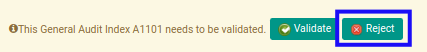
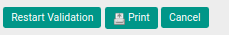

# Menolak Index A.110.1

## A. INPUT

* Data *Index A.110.1* yang akan ditolak harus memiliki status **Waiting for Approval**.

* User yang akan menolak harus memiliki akses untuk menolak *Index A.110.1*.

## B. LANGKAH KERJA

1. Buka menu **Accountant Service -> General Audit -> Risk Assessment-> Index A.110.1**. Abaikan jika sudah berada pada menu yang dimaksud.
2. Buka data *Index A.110.1* yang akan ditolak. Abaikan jika data sudah dibuka.
3. Klik tombol **Reject** pada bagian atas-kiri form.

## C. OUTPUT

* Data *Index A.110.1* telah ditolak.

