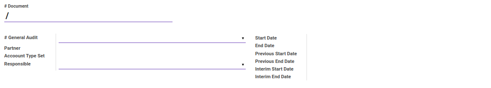
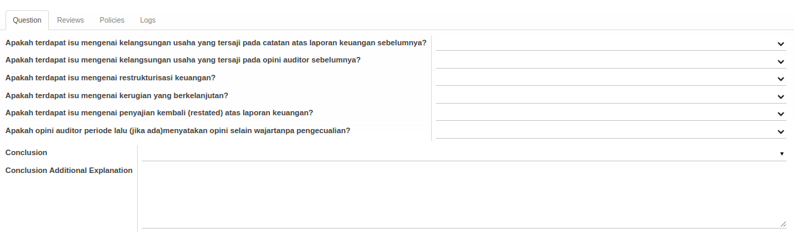
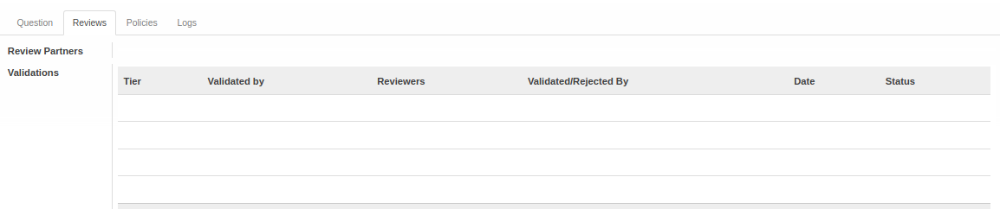
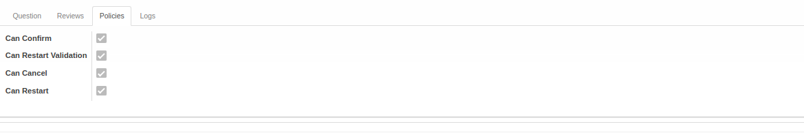
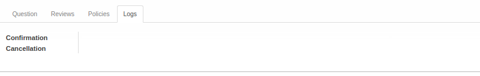

# Penjelasan Index A.110.1

Informasi pada *Index A.110.1* dibagi menjadi beberapa bagian, yaitu:

* [Header](#bagian-header)
* [Tab Question](#tab-question)
* [Tab Reviews](#tab-reviews)
* [Tab Policies](#tab-policies)
* [Tab Logs](#tab-logs)

### <a name="bagian-header">HEADER</a>

#### <a name="field-no-document"># Document</a>

Nomor dokumen.

#### <a name="field-no-general-audit"># General Audit</a>

Nomor general audit.

#### <a name="field-partner">Partner</a>

Nama partner.

#### <a name="field-account-type-set">Account Type Set</a>

Set tipe akun yang digunakan.

#### <a name="field-responsible">Responsible</a>

Nama penanggungjawab.

#### <a name="field-start-date">Start Date</a>

Tanggal awal.

#### <a name="field-end-date">End Date</a>

Tanggal akhir.

#### <a name="field-previous-start-date">Previous Start Date</a>

Tanggal awal sebelumnya.

#### <a name="field-previous-end-date">Previous End Date</a>

Tanggal akhir sebelumnya.

#### <a name="field-interim-start-date">Interim Start Date</a>

Tanggal awal sementara.

#### <a name="field-interim-end-date">Interim End Date</a>

Tanggal akhir sementara.

#### <a name="tab-question">TAB QUESTION</a>

#### <a name="field-question-1">Apakah terdapat isu mengenai kelangsungan usaha yang tersaji pada catatan atas laporan keuangan sebelumnya?</a>

Apakah terdapat isu mengenai kelangsungan usaha yang tersaji pada catatan atas laporan keuangan sebelumnya?

#### <a name="field-question-2">Apakah terdapat isu mengenai kelangsungan usaha yang tersaji pada opini auditor sebelumnya?</a>

Apakah terdapat isu mengenai kelangsungan usaha yang tersaji pada opini auditor sebelumnya?

#### <a name="field-question-3">Apakah terdapat isu mengenai restrukturisasi keuangan?</a>

Apakah terdapat isu mengenai restrukturisasi keuangan?

#### <a name="field-question-4">Apakah terdapat isu mengenai kerugian yang berkelanjutan?</a>

Apakah terdapat isu mengenai kerugian yang berkelanjutan?

#### <a name="field-question-5">Apakah terdapat isu mengenai penyajian kembali (restated) atas laporan keuangan?</a>

Apakah terdapat isu mengenai penyajian kembali (restated) atas laporan keuangan?

#### <a name="field-question-6">Apakah opini auditor periode lalu (jika ada) menyatakan opini selain wajar tanpa pengecualian?</a>

Apakah opini auditor periode lalu (jika ada) menyatakan opini selain wajar tanpa pengecualian?

#### <a name="field-conclusion">Conclusion</a>

Kesimpulan.

#### <a name="field-conclusion-add-explanation">Conclusion Additional Explanation</a>

Tambahan penjelasan kesimpulan.

#### <a name="tab-reviews">TAB REVIEWS</a>

#### <a name="field-review-partners-validations">Review Partners Validations</a>

Nama-nama user yang dapat menyetujui/menolak *Index A.110.1*

#### <a name="tabel-validations">TABEL Validations</a>

Tahapan-tahapan persetujuan *Index A.110.1*

#### <a name="field-validations-tier">Tier</a>

Urutan persetujuan

#### <a name="field-validations-validated-by">Validated By</a>

Metode pemilihan user-user yang dapat menyetujui/menolak *Index A.110.1*. Metode pemilihan terdiri dari 3 (tiga) yaitu:

1. *Specific user*. User-user yang dapat menyetujui/menolak *Index A.110.1* ditentukan langsung.
2. *Any user in specific group*. User-user yang dapat menyetujui/menolak *Index A.110.1* adalah user-user yang tergabung dalam kelompok-kelompok user yang ditentukan.
3. *Both specific user and group*. User-user yang dapat menyetujui/menolak *Index A.110.1* ditentukan langsung ditambah dengan user-user yang tergabung dalam kelompok-kelompok user yang ditentukan.
4. *Python code*. User-user yang dapat menyetujui/menolak *Index A.110.1* ditentukan oleh algoritma kode python tertentu

#### <a name="field-validations-reviewers">Reviewers</a>

Nama-nama user yang dapat menyetujui/menolak *Index A.110.1* pada *tier* yang dimaksud.

#### <a name="field-validations-validated-rejected">Validated/Rejected By</a>

User yang menyetujui/menolak *Index A.110.1*.

#### <a name="field-validations-date">Date</a>

Tanggal dan waktu **Validated/Rejected By** menyetujui/menolak *Index A.110.1*

#### <a name="field-validations-date">Status</a>

Status persetujuan, terdiri dari 2 (dua) kemungkinan:

1. **Approved**. Tier disetujui.
2. **Rejected**. Tier ditolak.

#### <a name="tab-policies">TAB POLICIES</a>

#### <a name="field-confirm">Can Confirm</a>

Berhak/tidaknya user aktif untuk dapat mengkonfirmasi Index A.110.1.

#### <a name="field-restart-validation">Can Restart Validation</a>

Berhak/tidaknya user aktif untuk dapat merestart persetujuan Index A.110.1.

#### <a name="field-cancel">Can Cancel</a>

Berhak/tidaknya user aktif untuk dapat membatalkan Index A.110.1.

#### <a name="field-restart">Can Restart</a>

Berhak/tidaknya user aktif untuk dapat merestart Index A.110.1.

#### <a name="tab-logs">TAB LOGS</a>

#### <a name="field-confirmation">Confirmation</a>

Waktu konfirmasi dan user yang mengkonfirmasi Index A.110.1.

#### <a name="field-cancellation">Cancellation</a>

Waktu batal dan user yang membatalkan Index A.110.1.
