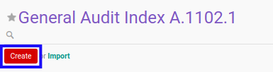
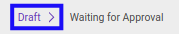

# Membuat Index A.1102.1

## A. INPUT

*(Tidak ada instruksi khusus)*

## B. LANGKAH KERJA

1. Buka menu **Accountant Service -> General Audit -> Risk Assessment-> Index A.1102.1**. Abaikan jika sudah berada pada menu yang dimaksud.
2. Klik tombol **Create** pada bagian atas-kiri form.

3. Ubah **[# Document](./penjelasan.md#field-no-document)** dengan penomeran yang dikehendaki. Biarkan berisi **/** apabila menghendaki penomeran otomatis.
4. Pilih **[# General Audit](./penjelasan.md#field-no-general-audit)**. Wajib diisi.
5. Pilih **[Responsible](./penjelasan.md#field-responsible)**. Wajib diisi.
6. Beralih ke tab **[Question - Profil Pengguna Jasa](./penjelasan.md#tab-question-profil)**.
7. Pilih **[Pejabat negara](./penjelasan.md#field-question-1)**. Tidak wajib diisi.
8. Pilih **[Pimpinan instansi pemerintah setingkat atau setara eselon I](./penjelasan.md#field-question-2)**. Tidak wajib diisi.
9. Pilih **[Pejabat yang memiliki fungsi strategis](./penjelasan.md#field-question-3)**. Tidak wajib diisi.
10. Pilih **[Pejabat yang berdasarkan ketentuan kementerian yang membidangi urusan..](./penjelasan.md#field-question-4)**. Tidak wajib diisi.
11. Pilih **[Pengurus partai politik atau anggota partai politik](./penjelasan.md#field-question-5)**. Tidak wajib diisi.
12. Pilih **[Keluarga inti PEP tek anggota keluarga sampai dengan derajat kedua](./penjelasan.md#field-question-6)**. Tidak wajib diisi.
13. Pilih **[Perusahaan yang dimiliki, dikelola, dan/ atau dikendalikan oleh PEP](./penjelasan.md#field-question-7)**. Tidak wajib diisi.
14. Pilih **[Pihak-pihak yang secara umum dan diketahui publik mempunyai hubungan dekat dengan PEP](./penjelasan.md#field-question-8)**. Tidak wajib diisi.
15. Pilih **[Perizinan, pengadaan dan penyaluran barang dan jasa publik, penerimaan negara atau daerah](./penjelasan.md#field-question-9)**. Tidak wajib diisi.
16. Pilih **[Penyedia jasa keuangan](./penjelasan.md#field-question-10)**. Tidak wajib diisi.
17. Pilih **[Terduga teroris dan organisasi teroris yang dikeluarkan oleh pemerintah](./penjelasan.md#field-question-11)**. Tidak wajib diisi.
18. Pilih **[Yang dikeluarkan oleh organisasi internasional; dan/ atau](./penjelasan.md#field-question-12)**. Tidak wajib diisi.
19. Pilih **[Termasuk karyawan yang bekerja pada kantor profesi tersebut diatas](./penjelasan.md#field-question-13)**. Tidak wajib diisi.
20. Beralih ke tab **[Question - Negara](./penjelasan.md#tab-question-negara)**.
21. Pilih **[Negara asing yang dinyatakan belum memadai dalam melaksanakan rekomendasi Financial Action Task Force](./penjelasan.md#field-question-14)**. Tidak wajib diisi.
22. Pilih **[Negara asing yang diketahui secara luas sebagai tempat penghasil dan pusat perdagangan narkoba](./penjelasan.md#field-question-15)**. Tidak wajib diisi.
23. Pilih **[Negara asing yang memiliki tingkat tata kelola kepemerintahan yang rendah atau dibawah 50 (lima puluh)](./penjelasan.md#field-question-16)**. Tidak wajib diisi.
24. Pilih **[Negara asing yang diidentifikasi sebagai tax haven antara lain berdasarkan data dari Organisation for](./penjelasan.md#field-question-17)**. Tidak wajib diisi.
25. Pilih **[Negara asing yang dikenal memiliki indeks persepsi korupsi yang rendah atau indeks dibawah 40 (empat puluh)](./penjelasan.md#field-question-18)**. Tidak wajib diisi.
26. Beralih ke tab **[Question - Bisnis](./penjelasan.md#tab-question-bisnis)**.
27. Pilih **[Usaha penukaran valuta asing non bank](./penjelasan.md#field-question-19)**. Tidak wajib diisi.
28. Pilih **[Usaha penyelenggara transfer dana non bank](./penjelasan.md#field-question-20)**. Tidak wajib diisi.
29. Pilih **[Usaha agen perjalanan](./penjelasan.md#field-question-21)**. Tidak wajib diisi.
30. Pilih **[Usaha yang berbasis tunai, diantaranya minimarket, jasa pengelola parkir, Stasiun Pengisian Bahan Bakar Umum (SPBU)](./penjelasan.md#field-question-22)**. Tidak wajib diisi.
31. Pilih **[Usaha investasi berbasis emas atau logam mulia](./penjelasan.md#field-question-23)**. Tidak wajib diisi.
32. Pilih **[Usaha di bidang pengelolaan hasil hutan atau kehutanan](./penjelasan.md#field-question-24)**. Tidak wajib diisi.
33. Pilih **[Usaha di bidang jasa pengangkutan atau pengapalan (freight forwarding)](./penjelasan.md#field-question-25)**. Tidak wajib diisi.
34. Pilih **[Usaha di bidang properti](./penjelasan.md#field-question-26)**. Tidak wajib diisi.
35. Pilih **[Usaha di bidang perdagangan kendaraan bermotor yang merupakan barang mewah](./penjelasan.md#field-question-27)**. Tidak wajib diisi.
36. Pilih **[Usaha di bidang perdagangan permata dan perhiasan atau logam mulia](./penjelasan.md#field-question-28)**. Tidak wajib diisi.
37. Pilih **[Usaha di bidang perdagangan barang seni dan antik](./penjelasan.md#field-question-29)**. Tidak wajib diisi.
38. Pilih **[Koperasi yang melakukan kegiatan simpan pinjam dengan nilai aset Rp1.000.000.000 (satu milyar rupiah) atau lebih](./penjelasan.md#field-question-30)**. Tidak wajib diisi.
39. Pilih **[Usaha perdagangan ekspor/impor di bidang sumber daya alam hayati dan non hayati spt minyak, mineral dan batu bara](./penjelasan.md#field-question-31)**. Tidak wajib diisi.
40. Beralih ke tab **[Question - Produk dan/atau Jasa](./penjelasan.md#tab-question-produk)**.
41. Pilih **[Transfer dana (wire transfer)](./penjelasan.md#field-question-32)**. Tidak wajib diisi.
42. Pilih **[Instrumen pembayaran lain (bearer negotiable instruments) diantaranya bilyet giro, warkat atas bawa berupa cek](./penjelasan.md#field-question-33)**. Tidak wajib diisi.
43. Pilih **[Layanan cross border correspondent banking antara lain payable through account](./penjelasan.md#field-question-34)**. Tidak wajib diisi.
44. Pilih **[Electronic banking termasuk internet banking, phone banking, mobile banking, sms banking](./penjelasan.md#field-question-35)**. Tidak wajib diisi.
45. Pilih **[Layanan prima (private banking) atau wealth management](./penjelasan.md#field-question-36)**. Tidak wajib diisi.
46. Pilih **[Penitipan dengan pengelolaan (trust)](./penjelasan.md#field-question-37)**. Tidak wajib diisi.
47. Pilih **[Alat pembayaran menggunakan kartu antara lain kartu kredit, kartu atm, kartu debit](./penjelasan.md#field-question-38)**. Tidak wajib diisi.
48. Pilih **[Kontrak pengelolaan dana (discretionary fund)](./penjelasan.md#field-question-39)**. Tidak wajib diisi.
49. Pilih **[Custodian](./penjelasan.md#field-question-40)**. Tidak wajib diisi.
50. Pilih **[Non deposit account services antara lain unit link, reksadana, safe deposit box, obligasi, surat utang negara](./penjelasan.md#field-question-41)**. Tidak wajib diisi.
51. Pilih **[E-money](./penjelasan.md#field-question-42)**. Tidak wajib diisi.
52. Pilih **[Produk komoditi berjangka](./penjelasan.md#field-question-43)**. Tidak wajib diisi.
53. Pilih **[Gadai emas](./penjelasan.md#field-question-44)**. Tidak wajib diisi.
54. Beralih ke tab **[Question - Analisa](./penjelasan.md#tab-question-analisa)**.
55. Pilih **[Status](./penjelasan.md#field-question-analisa-status)**. Tidak wajib diisi.
56. Isi **[Conclusion](./penjelasan.md#field-question-analisa-conclusion)**. Tidak wajib diisi.
57. Klik tombol **Save** pada bagian atas-kiri form.

## C. OUTPUT

* Data *Index A.1102.1* akan terbuat dengan status **Draft**

