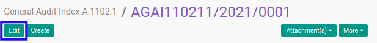
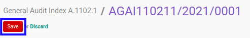

# Memodifikasi Index A.1102.1

## A. INPUT

* Data *Index A.1102.1* yang dapat dimodifikasi harus memiliki status **Draft**.

* User yang akan memodifikasi harus memiliki akses untuk memodifikasi *Index A.1102.1*.

## B. LANGKAH KERJA

1. Buka menu **Accountant Service -> General Audit -> Risk Assessment-> Index A.1102.1**. Abaikan jika sudah berada pada menu yang dimaksud.
2. Buka data *Index A.1102.1* yang akan dimodifikasi. Abaikan jika data sudah dibuka.
3. Klik tombol **Edit** pada bagian atas-kiri form.

4. Ubah **[# Document](./penjelasan.md#field-no-document)** dengan penomeran yang dikehendaki. Biarkan berisi **/** apabila menghendaki penomeran otomatis.
5. Pilih dan sesuaikan **[# General Audit](./penjelasan.md#field-no-general-audit)** jika dibutuhkan. Wajib diisi.
6. Pilih dan sesuaikan **[Responsible](./penjelasan.md#field-responsible)** jika dibutuhkan. Wajib diisi.
7. Beralih ke tab **[Question - Profil Pengguna Jasa](./penjelasan.md#tab-question-profil)**.
8. Pilih dan sesuaikan **[Pejabat negara](./penjelasan.md#field-question-1)** jika dibutuhkan. Tidak wajib diisi.
9. Pilih dan sesuaikan **[Pimpinan instansi pemerintah setingkat atau setara eselon I](./penjelasan.md#field-question-2)** jika dibutuhkan. Tidak wajib diisi.
10. Pilih dan sesuaikan **[Pejabat yang memiliki fungsi strategis](./penjelasan.md#field-question-3)** jika dibutuhkan. Tidak wajib diisi.
11. Pilih dan sesuaikan **[Pejabat yang berdasarkan ketentuan kementerian yang membidangi urusan..](./penjelasan.md#field-question-4)** jika dibutuhkan. Tidak wajib diisi.
12. Pilih dan sesuaikan **[Pengurus partai politik atau anggota partai politik](./penjelasan.md#field-question-5)** jika dibutuhkan. Tidak wajib diisi.
13. Pilih dan sesuaikan **[Keluarga inti PEP tek anggota keluarga sampai dengan derajat kedua](./penjelasan.md#field-question-6)** jika dibutuhkan. Tidak wajib diisi.
14. Pilih dan sesuaikan **[Perusahaan yang dimiliki, dikelola, dan/ atau dikendalikan oleh PEP](./penjelasan.md#field-question-7)** jika dibutuhkan. Tidak wajib diisi.
15. Pilih dan sesuaikan **[Pihak-pihak yang secara umum dan diketahui publik mempunyai hubungan dekat dengan PEP](./penjelasan.md#field-question-8)** jika dibutuhkan. Tidak wajib diisi.
16. Pilih dan sesuaikan **[Perizinan, pengadaan dan penyaluran barang dan jasa publik, penerimaan negara atau daerah](./penjelasan.md#field-question-9)** jika dibutuhkan. Tidak wajib diisi.
17. Pilih dan sesuaikan **[Penyedia jasa keuangan](./penjelasan.md#field-question-10)** jika dibutuhkan. Tidak wajib diisi.
18. Pilih dan sesuaikan **[Terduga teroris dan organisasi teroris yang dikeluarkan oleh pemerintah](./penjelasan.md#field-question-11)** jika dibutuhkan. Tidak wajib diisi.
19. Pilih dan sesuaikan **[Yang dikeluarkan oleh organisasi internasional; dan/ atau](./penjelasan.md#field-question-12)** jika dibutuhkan. Tidak wajib diisi.
20. Pilih dan sesuaikan **[Termasuk karyawan yang bekerja pada kantor profesi tersebut diatas](./penjelasan.md#field-question-13)** jika dibutuhkan. Tidak wajib diisi.
21. Beralih ke tab **[Question - Negara](./penjelasan.md#tab-question-negara)**.
22. Pilih dan sesuaikan **[Negara asing yang dinyatakan belum memadai dalam melaksanakan rekomendasi Financial Action Task Force](./penjelasan.md#field-question-14)** jika dibutuhkan. Tidak wajib diisi.
23. Pilih dan sesuaikan **[Negara asing yang diketahui secara luas sebagai tempat penghasil dan pusat perdagangan narkoba](./penjelasan.md#field-question-15)** jika dibutuhkan. Tidak wajib diisi.
24. Pilih dan sesuaikan **[Negara asing yang memiliki tingkat tata kelola kepemerintahan yang rendah atau dibawah 50 (lima puluh)](./penjelasan.md#field-question-16)** jika dibutuhkan. Tidak wajib diisi.
25. Pilih dan sesuaikan **[Negara asing yang diidentifikasi sebagai tax haven antara lain berdasarkan data dari Organisation for](./penjelasan.md#field-question-17)** jika dibutuhkan. Tidak wajib diisi.
26. Pilih dan sesuaikan **[Negara asing yang dikenal memiliki indeks persepsi korupsi yang rendah atau indeks dibawah 40 (empat puluh)](./penjelasan.md#field-question-18)** jika dibutuhkan. Tidak wajib diisi.
27. Beralih ke tab **[Question - Bisnis](./penjelasan.md#tab-question-bisnis)**.
28. Pilih dan sesuaikan **[Usaha penukaran valuta asing non bank](./penjelasan.md#field-question-19)** jika dibutuhkan. Tidak wajib diisi.
29. Pilih dan sesuaikan **[Usaha penyelenggara transfer dana non bank](./penjelasan.md#field-question-20)** jika dibutuhkan. Tidak wajib diisi.
30. Pilih dan sesuaikan **[Usaha agen perjalanan](./penjelasan.md#field-question-21)** jika dibutuhkan. Tidak wajib diisi.
31. Pilih dan sesuaikan **[Usaha yang berbasis tunai, diantaranya minimarket, jasa pengelola parkir, Stasiun Pengisian Bahan Bakar Umum (SPBU)](./penjelasan.md#field-question-22)** jika dibutuhkan. Tidak wajib diisi.
32. Pilih dan sesuaikan **[Usaha investasi berbasis emas atau logam mulia](./penjelasan.md#field-question-23)** jika dibutuhkan. Tidak wajib diisi.
33. Pilih dan sesuaikan **[Usaha di bidang pengelolaan hasil hutan atau kehutanan](./penjelasan.md#field-question-24)** jika dibutuhkan. Tidak wajib diisi.
34. Pilih dan sesuaikan **[Usaha di bidang jasa pengangkutan atau pengapalan (freight forwarding)](./penjelasan.md#field-question-25)** jika dibutuhkan. Tidak wajib diisi.
35. Pilih dan sesuaikan **[Usaha di bidang properti](./penjelasan.md#field-question-26)** jika dibutuhkan. Tidak wajib diisi.
36. Pilih dan sesuaikan **[Usaha di bidang perdagangan kendaraan bermotor yang merupakan barang mewah](./penjelasan.md#field-question-27)** jika dibutuhkan. Tidak wajib diisi.
37. Pilih dan sesuaikan **[Usaha di bidang perdagangan permata dan perhiasan atau logam mulia](./penjelasan.md#field-question-28)** jika dibutuhkan. Tidak wajib diisi.
38. Pilih dan sesuaikan **[Usaha di bidang perdagangan barang seni dan antik](./penjelasan.md#field-question-29)** jika dibutuhkan. Tidak wajib diisi.
39. Pilih dan sesuaikan **[Koperasi yang melakukan kegiatan simpan pinjam dengan nilai aset Rp1.000.000.000 (satu milyar rupiah) atau lebih](./penjelasan.md#field-question-30)** jika dibutuhkan. Tidak wajib diisi.
40. Pilih dan sesuaikan **[Usaha perdagangan ekspor/impor di bidang sumber daya alam hayati dan non hayati spt minyak, mineral dan batu bara](./penjelasan.md#field-question-31)** jika dibutuhkan. Tidak wajib diisi.
41. Beralih ke tab **[Question - Produk dan/atau Jasa](./penjelasan.md#tab-question-produk)**.
42. Pilih dan sesuaikan **[Transfer dana (wire transfer)](./penjelasan.md#field-question-32)** jika dibutuhkan. Tidak wajib diisi.
43. Pilih dan sesuaikan **[Instrumen pembayaran lain (bearer negotiable instruments) diantaranya bilyet giro, warkat atas bawa berupa cek](./penjelasan.md#field-question-33)** jika dibutuhkan. Tidak wajib diisi.
44. Pilih dan sesuaikan **[Layanan cross border correspondent banking antara lain payable through account](./penjelasan.md#field-question-34)** jika dibutuhkan. Tidak wajib diisi.
45. Pilih dan sesuaikan **[Electronic banking termasuk internet banking, phone banking, mobile banking, sms banking](./penjelasan.md#field-question-35)** jika dibutuhkan. Tidak wajib diisi.
46. Pilih dan sesuaikan **[Layanan prima (private banking) atau wealth management](./penjelasan.md#field-question-36)** jika dibutuhkan. Tidak wajib diisi.
47. Pilih dan sesuaikan **[Penitipan dengan pengelolaan (trust)](./penjelasan.md#field-question-37)** jika dibutuhkan. Tidak wajib diisi.
48. Pilih dan sesuaikan **[Alat pembayaran menggunakan kartu antara lain kartu kredit, kartu atm, kartu debit](./penjelasan.md#field-question-38)** jika dibutuhkan. Tidak wajib diisi.
49. Pilih dan sesuaikan **[Kontrak pengelolaan dana (discretionary fund)](./penjelasan.md#field-question-39)** jika dibutuhkan. Tidak wajib diisi.
50. Pilih dan sesuaikan **[Custodian](./penjelasan.md#field-question-40)** jika dibutuhkan. Tidak wajib diisi.
51. Pilih dan sesuaikan **[Non deposit account services antara lain unit link, reksadana, safe deposit box, obligasi, surat utang negara](./penjelasan.md#field-question-41)** jika dibutuhkan. Tidak wajib diisi.
52. Pilih dan sesuaikan **[E-money](./penjelasan.md#field-question-42)** jika dibutuhkan. Tidak wajib diisi.
53. Pilih dan sesuaikan **[Produk komoditi berjangka](./penjelasan.md#field-question-43)** jika dibutuhkan. Tidak wajib diisi.
54. Pilih dan sesuaikan **[Gadai emas](./penjelasan.md#field-question-44)** jika dibutuhkan. Tidak wajib diisi.
55. Beralih ke tab **[Question - Analisa](./penjelasan.md#tab-question-analisa)**.
56. Pilih dan sesuaikan **[Status](./penjelasan.md#field-question-analisa-status)** jika dibutuhkan. Tidak wajib diisi.
57. Isi dan sesuaikan **[Conclusion](./penjelasan.md#field-question-analisa-conclusion)** jika dibutuhkan. Tidak wajib diisi.
58. Klik tombol **Save** pada bagian atas-kiri form.

## C. OUTPUT

* Data *Index A.1102.1* akan berubah sesuai dengan perubahan yang dilakukan.
