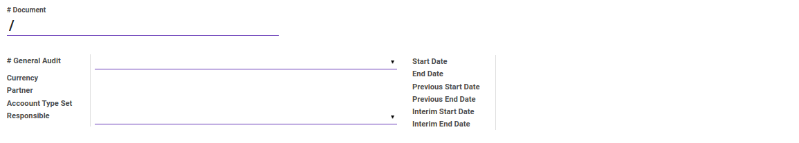
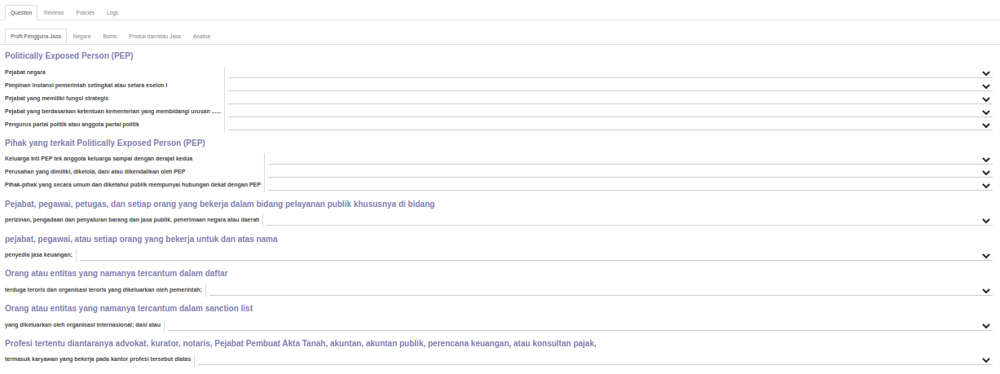
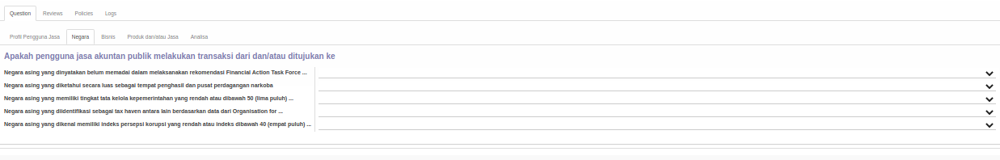
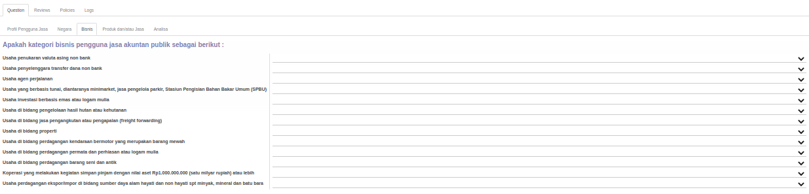
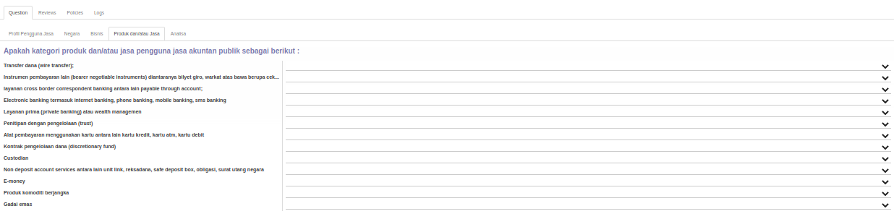
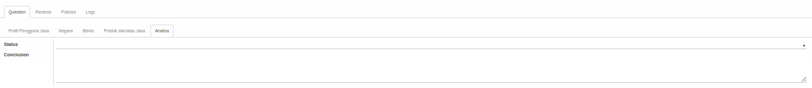
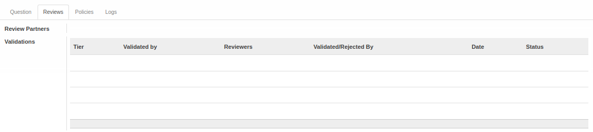
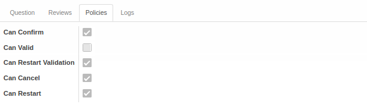
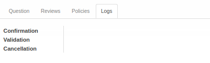

# Penjelasan Index A.1102.1

Informasi pada *Index A.1102.1* dibagi menjadi beberapa bagian, yaitu:

* [Header](#bagian-header)
* [Tab Question - Profil Pengguna Jasa](#tab-question-profil)
* [Tab Question - Negara](#tab-question-negara)
* [Tab Question - Bisnis](#tab-question-bisnis)
* [Tab Question - Produk dan/atau Jasa](#tab-question-produk)
* [Tab Question - Analisa](#tab-question-analisa)
* [Tab Reviews](#tab-reviews)
* [Tab Policies](#tab-policies)
* [Tab Logs](#tab-logs)

### <a name="bagian-header">HEADER</a>

#### <a name="field-no-document"># Document</a>

Nomor dokumen.

#### <a name="field-no-general-audit"># General Audit</a>

Nomor general audit.

#### <a name="field-currency">Currency</a>

Mata uang yang digunakan.

#### <a name="field-partner">Partner</a>

Nama partner.

#### <a name="field-account-type-set">Account Type Set</a>

Set tipe akun yang digunakan.

#### <a name="field-responsible">Responsible</a>

Nama penanggungjawab.

#### <a name="field-start-date">Start Date</a>

Tanggal awal.

#### <a name="field-end-date">End Date</a>

Tanggal akhir.

#### <a name="field-previous-start-date">Previous Start Date</a>

Tanggal awal sebelumnya.

#### <a name="field-previous-end-date">Previous End Date</a>

Tanggal akhir sebelumnya.

#### <a name="field-interim-start-date">Interim Start Date</a>

Tanggal awal sementara.

#### <a name="field-interim-end-date">Interim End Date</a>

Tanggal akhir sementara.

#### <a name="tab-question-profil">TAB QUESTION - PROFIL PENGGUNA JASA</a>

***Politically Exposed Person (PEP)***

#### <a name="field-question-1">Pejabat Negara</a>

Pejabat Negara.

#### <a name="field-question-2">Pimpinan instansi pemerintah setingkat atau setara eselon I</a>

Pimpinan instansi pemerintah setingkat atau setara eselon I.

#### <a name="field-question-3">Pejabat yang memiliki fungsi strategis</a>

Pejabat yang memiliki fungsi strategis.

#### <a name="field-question-4">Pejabat yang berdasarkan ketentuan kementerian yang membidangi urusan ......</a>

Pejabat yang berdasarkan ketentuan kementerian yang membidangi urusan ......

#### <a name="field-question-5">Pengurus partai politik atau anggota partai politik</a>

Pengurus partai politik atau anggota partai politik.

***Pihak yang terkait Politically Exposed Person (PEP)***

#### <a name="field-question-6">Keluarga inti PEP tek anggota keluarga sampai dengan derajat kedua</a>

Keluarga inti PEP tek anggota keluarga sampai dengan derajat kedua.

#### <a name="field-question-7">Perusahaan yang dimiliki, dikelola, dan/ atau dikendalikan oleh PEP</a>

Perusahaan yang dimiliki, dikelola, dan/ atau dikendalikan oleh PEP.

#### <a name="field-question-8">Pihak-pihak yang secara umum dan diketahui publik mempunyai hubungan dekat dengan PEP</a>

Pihak-pihak yang secara umum dan diketahui publik mempunyai hubungan dekat dengan PEP.

***Pejabat, pegawai, petugas, dan setiap orang yang bekerja dalam bidang pelayanan publik khususnya di bidang***

#### <a name="field-question-9">Perizinan, pengadaan dan penyaluran barang dan jasa publik, penerimaan negara atau daerah</a>

Perizinan, pengadaan dan penyaluran barang dan jasa publik, penerimaan negara atau daerah.

***Pejabat, pegawai, atau setiap orang yang bekerja untuk dan atas nama***

#### <a name="field-question-10">Penyedia jasa keuangan</a>

Penyedia jasa keuangan.

***Orang atau entitas yang namanya tercantum dalam daftar***

#### <a name="field-question-11">Terduga teroris dan organisasi teroris yang dikeluarkan oleh pemerintah</a>

Terduga teroris dan organisasi teroris yang dikeluarkan oleh pemerintah.

***Orang atau entitas yang namanya tercantum dalam sanction list***

#### <a name="field-question-12">Yang dikeluarkan oleh organisasi internasional; dan/ atau</a>

Yang dikeluarkan oleh organisasi internasional; dan/ atau.

***Profesi tertentu diantaranya advokat, kurator, notaris, Pejabat Pembuat Akta Tanah, akuntan, akuntan publik, perencana keuangan, atau konsultan pajak***

#### <a name="field-question-13">Termasuk karyawan yang bekerja pada kantor profesi tersebut diatas</a>

Termasuk karyawan yang bekerja pada kantor profesi tersebut diatas.

#### <a name="tab-question-negara">TAB QUESTION - NEGARA</a>

***Apakah pengguna jasa akuntan publik melakukan transaksi dari dan/atau ditujukan ke***

#### <a name="field-question-14">Negara asing yang dinyatakan belum memadai dalam melaksanakan rekomendasi Financial Action Task Force ...</a>

Negara asing yang dinyatakan belum memadai dalam melaksanakan rekomendasi Financial Action Task Force ....

#### <a name="field-question-15">Negara asing yang diketahui secara luas sebagai tempat penghasil dan pusat perdagangan narkoba</a>

Negara asing yang diketahui secara luas sebagai tempat penghasil dan pusat perdagangan narkoba.

#### <a name="field-question-16">Negara asing yang memiliki tingkat tata kelola kepemerintahan yang rendah atau dibawah 50 (lima puluh) ...</a>

Negara asing yang memiliki tingkat tata kelola kepemerintahan yang rendah atau dibawah 50 (lima puluh).

#### <a name="field-question-17">Negara asing yang diidentifikasi sebagai tax haven antara lain berdasarkan data dari Organisation for ...</a>

Negara asing yang diidentifikasi sebagai tax haven antara lain berdasarkan data dari Organisation for ...

#### <a name="field-question-18">Negara asing yang dikenal memiliki indeks persepsi korupsi yang rendah atau indeks dibawah 40 (empat puluh) ...</a>

Negara asing yang dikenal memiliki indeks persepsi korupsi yang rendah atau indeks dibawah 40 (empat puluh) ...

#### <a name="tab-question-bisnis">TAB QUESTION - BISNIS</a>

***Apakah kategori bisnis pengguna jasa akuntan publik sebagai berikut:***

#### <a name="field-question-19">Usaha penukaran valuta asing non bank</a>

Usaha penukaran valuta asing non bank.

#### <a name="field-question-20">Usaha penyelenggara transfer dana non bank</a>

Usaha penyelenggara transfer dana non bank.

#### <a name="field-question-21">Usaha agen perjalanan</a>

Usaha agen perjalanan.

#### <a name="field-question-22">Usaha yang berbasis tunai, diantaranya minimarket, jasa pengelola parkir, Stasiun Pengisian Bahan Bakar Umum (SPBU)</a>

Usaha yang berbasis tunai, diantaranya minimarket, jasa pengelola parkir, Stasiun Pengisian Bahan Bakar Umum (SPBU).

#### <a name="field-question-23">Usaha investasi berbasis emas atau logam mulia</a>

Usaha investasi berbasis emas atau logam mulia.

#### <a name="field-question-24">Usaha di bidang pengelolaan hasil hutan atau kehutanan</a>

Usaha di bidang pengelolaan hasil hutan atau kehutanan.

#### <a name="field-question-25">Usaha di bidang jasa pengangkutan atau pengapalan (freight forwarding)</a>

Usaha di bidang jasa pengangkutan atau pengapalan (freight forwarding).

#### <a name="field-question-26">Usaha di bidang properti</a>

Usaha di bidang properti.

#### <a name="field-question-27">Usaha di bidang perdagangan kendaraan bermotor yang merupakan barang mewah</a>

Usaha di bidang perdagangan kendaraan bermotor yang merupakan barang mewah.

#### <a name="field-question-28">Usaha di bidang perdagangan permata dan perhiasan atau logam mulia</a>

Usaha di bidang perdagangan permata dan perhiasan atau logam mulia.

#### <a name="field-question-29">Usaha di bidang perdagangan barang seni dan antik</a>

Usaha di bidang perdagangan barang seni dan antik.

#### <a name="field-question-30">Koperasi yang melakukan kegiatan simpan pinjam dengan nilai aset Rp1.000.000.000 (satu milyar rupiah) atau lebih</a>

Koperasi yang melakukan kegiatan simpan pinjam dengan nilai aset Rp1.000.000.000 (satu milyar rupiah) atau lebih.

#### <a name="field-question-31">Usaha perdagangan ekspor/impor di bidang sumber daya alam hayati dan non hayati spt minyak, mineral dan batu bara</a>

Usaha perdagangan ekspor/impor di bidang sumber daya alam hayati dan non hayati spt minyak, mineral dan batu bara.

#### <a name="tab-question-produk">TAB QUESTION - PRODUK DAN/ATAU JASA</a>

***Apakah kategori produk dan/atau jasa pengguna jasa akuntan publik sebagai berikut :***

#### <a name="field-question-32">Transfer dana (wire transfer)</a>

Transfer dana (wire transfer).

#### <a name="field-question-33">Instrumen pembayaran lain (bearer negotiable instruments) diantaranya bilyet giro, warkat atas bawa berupa cek...</a>

Instrumen pembayaran lain (bearer negotiable instruments) diantaranya bilyet giro, warkat atas bawa berupa cek....

#### <a name="field-question-34">Layanan cross border correspondent banking antara lain payable through account</a>

Layanan cross border correspondent banking antara lain payable through account.

#### <a name="field-question-35">Electronic banking termasuk internet banking, phone banking, mobile banking, sms banking</a>

Electronic banking termasuk internet banking, phone banking, mobile banking, sms banking.

#### <a name="field-question-36">Layanan prima (private banking) atau wealth management</a>

Layanan prima (private banking) atau wealth management.

#### <a name="field-question-37">Penitipan dengan pengelolaan (trust)</a>

Penitipan dengan pengelolaan (trust).

#### <a name="field-question-38">Alat pembayaran menggunakan kartu antara lain kartu kredit, kartu atm, kartu debit</a>

Alat pembayaran menggunakan kartu antara lain kartu kredit, kartu atm, kartu debit.

#### <a name="field-question-39">Kontrak pengelolaan dana (discretionary fund)</a>

Kontrak pengelolaan dana (discretionary fund).

#### <a name="field-question-40">Custodian</a>

Custodian.

#### <a name="field-question-41">Non deposit account services antara lain unit link, reksadana, safe deposit box, obligasi, surat utang negara</a>

Non deposit account services antara lain unit link, reksadana, safe deposit box, obligasi, surat utang negara.

#### <a name="field-question-42">E-money</a>

E-money.

#### <a name="field-question-43">Produk komoditi berjangka</a>

Produk komoditi berjangka.

#### <a name="field-question-44">Gadai emas</a>

Gadai emas.

#### <a name="tab-question-analisa">TAB QUESTION - ANALISA</a>

#### <a name="field-question-analisa-status">Status</a>

Status.

#### <a name="field-question-analisa-conclusion">Conclusion</a>

Kesimpulan.

#### <a name="tab-reviews">TAB REVIEWS</a>

#### <a name="field-review-partners-validations">Review Partners Validations</a>

Nama-nama user yang dapat menyetujui/menolak *Index A.1102.1*

#### <a name="tabel-validations">TABEL Validations</a>

Tahapan-tahapan persetujuan *Index A.1102.1*

#### <a name="field-validations-tier">Tier</a>

Urutan persetujuan

#### <a name="field-validations-validated-by">Validated By</a>

Metode pemilihan user-user yang dapat menyetujui/menolak *Index A.1102.1*. Metode pemilihan terdiri dari 3 (tiga) yaitu:

1. *Specific user*. User-user yang dapat menyetujui/menolak *Index A.1102.1* ditentukan langsung.
2. *Any user in specific group*. User-user yang dapat menyetujui/menolak *Index A.1102.1* adalah user-user yang tergabung dalam kelompok-kelompok user yang ditentukan.
3. *Both specific user and group*. User-user yang dapat menyetujui/menolak *Index A.1102.1* ditentukan langsung ditambah dengan user-user yang tergabung dalam kelompok-kelompok user yang ditentukan.
4. *Python code*. User-user yang dapat menyetujui/menolak *Index A.1102.1* ditentukan oleh algoritma kode python tertentu

#### <a name="field-validations-reviewers">Reviewers</a>

Nama-nama user yang dapat menyetujui/menolak *Index A.1102.1* pada *tier* yang dimaksud.

#### <a name="field-validations-validated-rejected">Validated/Rejected By</a>

User yang menyetujui/menolak *Index A.1102.1*.

#### <a name="field-validations-date">Date</a>

Tanggal dan waktu **Validated/Rejected By** menyetujui/menolak *Index A.1102.1*

#### <a name="field-validations-date">Status</a>

Status persetujuan, terdiri dari 2 (dua) kemungkinan:

1. **Approved**. Tier disetujui.
2. **Rejected**. Tier ditolak.

#### <a name="tab-policies">TAB POLICIES</a>

#### <a name="field-confirm">Can Confirm</a>

Berhak/tidaknya user aktif untuk dapat mengkonfirmasi Index A.1102.1.

#### <a name="field-valid">Can Valid</a>

Berhak/tidaknya user aktif untuk dapat menyetujui Index A.1102.1.

#### <a name="field-restart-validation">Can Restart Validation</a>

Berhak/tidaknya user aktif untuk dapat merestart persetujuan Index A.1102.1.

#### <a name="field-cancel">Can Cancel</a>

Berhak/tidaknya user aktif untuk dapat membatalkan Index A.1102.1.

#### <a name="field-restart">Can Restart</a>

Berhak/tidaknya user aktif untuk dapat merestart Index A.1102.1.

#### <a name="tab-logs">TAB LOGS</a>

#### <a name="field-confirmation">Confirmation</a>

Waktu konfirmasi dan user yang mengkonfirmasi Index A.1102.1.

#### <a name="field-validation">Validation</a>

Waktu persetujuan dan user yang menyetujui Index A.1102.1.

#### <a name="field-cancellation">Cancellation</a>

Waktu batal dan user yang membatalkan Index A.1102.1.
