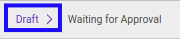

# Memodifikasi Index A.110.4

## A. INPUT

* Data *Index A.110.4* yang dapat dimodifikasi harus memiliki status **Draft**.

* User yang akan memodifikasi harus memiliki akses untuk memodifikasi *Index A.110.4*.

## B. LANGKAH KERJA

1. Buka menu **Accountant Service -> General Audit -> Risk Assessment-> Index A.110.4**. Abaikan jika sudah berada pada menu yang dimaksud.
2. Buka data *Index A.110.4* yang akan dimodifikasi. Abaikan jika data sudah dibuka.
3. Klik tombol **Edit** pada bagian atas-kiri form.

4. Ubah **[# Document](./penjelasan.md#field-no-document)** dengan penomeran yang dikehendaki. Biarkan berisi **/** apabila menghendaki penomeran otomatis.
5. Pilih dan sesuaikan **[# General Audit](./penjelasan.md#field-no-general-audit)** jika dibutuhkan. Wajib diisi.
6. Pilih dan sesuaikan **[Responsible](./penjelasan.md#field-responsible)** jika dibutuhkan. Wajib diisi.
7. Beralih ke tab **[Question](./penjelasan.md#tab-question)**.
8. Pilih dan sesuaikan **[Jika calon klien merupakan perikatan audit LK tahun pertama, apakah sudah dilakukan komunikasi dengan auditor pendahulu?](./penjelasan.md#field-question-1)** jika dibutuhkan. Tidak wajib diisi.
9. Pilih dan sesuaikan **[Apakah balasan komunikasi dari auditor pendahulu sudah diterima?](./penjelasan.md#field-question-2)** jika dibutuhkan. Tidak wajib diisi.
10. Pilih dan sesuaikan **[Apakah ada keberatan profesional atas penggantian auditor?](./penjelasan.md#field-question-3)** jika dibutuhkan. Tidak wajib diisi.
11. Pilih dan sesuaikan **[Apakah terdapat permasalahan imbalan jasa yang belum diselesaikan oleh manajemen?](./penjelasan.md#field-question-4)** jika dibutuhkan. Tidak wajib diisi.
12. Pilih dan sesuaikan **[Status](./penjelasan.md#field-status)** jika dibutuhkan. Tidak wajib diisi.
13. Isi dan sesuaikan **[Conclusion](./penjelasan.md#field-conclusion)** jika dibutuhkan. Tidak wajib diisi.
14. Klik tombol **Save** pada bagian atas-kiri form.

## C. OUTPUT

* Data *Index A.110.4* akan berubah sesuai dengan perubahan yang dilakukan.
