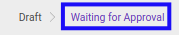
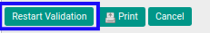

# Merestart Persetujuan Index A.110.4

## A. INPUT

* *Index A.110.4* yang dapat direstart persetujuan harus memiliki status **Waiting for Approval**.

* User yang akan merestart persetujuan harus memiliki akses untuk merestart persetujuan *Index A.110.4*.

## B. LANGKAH KERJA

1. Buka menu **Accountant Service -> General Audit -> Risk Assessment-> Index A.110.4**. Abaikan jika sudah berada pada menu yang dimaksud.
2. Buka data *Index A.110.4* yang akan direstart persetujuan. Abaikan jika data sudah dibuka.
3. Klik tombol **Restart Validation** pada bagian atas-kiri form.

## C. OUTPUT

* User dapat kembali menyetujui/menolak data *Index A.110.4*.

