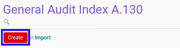

# Membuat Index A.130

## A. INPUT

*(Tidak ada instruksi khusus)*

## B. LANGKAH KERJA

1. Buka menu **Accountant Service -> General Audit -> Risk Assessment-> Index A.130**. Abaikan jika sudah berada pada menu yang dimaksud.
2. Klik tombol **Create** pada bagian atas-kiri form.

3. Ubah **[# Document](./penjelasan.md#field-no-document)** dengan penomeran yang dikehendaki. Biarkan berisi **/** apabila menghendaki penomeran otomatis.
4. Pilih **[# General Audit](./penjelasan.md#field-no-general-audit)**. Wajib diisi.
5. Pilih **[Responsible](./penjelasan.md#field-responsible)**. Wajib diisi.
6. Beralih ke tab **[Question](./penjelasan.md#tab-question)**.
7. Pilih **[Penanggalan surat sesuai dengan tanggal yang disepakati](./penjelasan.md#field-question-1)**. Tidak wajib diisi.
8. Pilih **[Penomoran surat sesuai dengan tertib administrasi yang berlaku](./penjelasan.md#field-question-2)**. Tidak wajib diisi.
9. Pilih **[Penjelasan tujuan dan ruang lingkup audit](./penjelasan.md#field-question-3)**. Tidak wajib diisi.
10. Pilih **[Penyusunan laporan keuangan sesuai kerangka pelaporan keuangan yang berlaku](./penjelasan.md#field-question-4)**. Tidak wajib diisi.
11. Pilih **[Pengendalian internal agar laporan keuangan bebas dari salah saji material](./penjelasan.md#field-question-5)**. Tidak wajib diisi.
12. Pilih **[Memberikan Auditor Akses ke semua informasi yang relevan](./penjelasan.md#field-question-6)**. Tidak wajib diisi.
13. Pilih **[Memberikan Auditor Informasi tambahan yang diperlukan](./penjelasan.md#field-question-7)**. Tidak wajib diisi.
14. Pilih **[Memberikan Auditor Akses ke semua personel](./penjelasan.md#field-question-8)**. Tidak wajib diisi.
15. Pilih **[Bentuk komunikasi yang diharapkan dalam penyampaian hasil audit](./penjelasan.md#field-question-9)**. Tidak wajib diisi.
16. Pilih **[Ekspektasi penyampaian representasi tertulis](./penjelasan.md#field-question-10)**. Tidak wajib diisi.
17. Pilih **[Penyediaan draft laporan keuangan tepat waktu](./penjelasan.md#field-question-11)**. Tidak wajib diisi.
18. Pilih **[Pengacuan ke bentuk dan isi laporan yang akan dikeluarkan oleh auditor dan suatu pernyataan bahwa..](./penjelasan.md#field-question-12)**. Tidak wajib diisi.
19. Pilih **[Klausul kerahasiaan kecuali diminta oleh Hukum/Regulator/Asosiasi Profesi](./penjelasan.md#field-question-13)**. Tidak wajib diisi.
20. Pilih **[Tidak menjanjikan opini wajar tanpa pengecualian](./penjelasan.md#field-question-14)**. Tidak wajib diisi.
21. Pilih **[Perhatian khusus terhadap peraturan yang berlaku bagi klien](./penjelasan.md#field-question-15)**. Tidak wajib diisi.
22. Pilih **[Status](./penjelasan.md#field-status)**. Tidak wajib diisi.
23. Isi **[Conclusion](./penjelasan.md#field-conclusion)**. Tidak wajib diisi.
24. Klik tombol **Save** pada bagian atas-kiri form.

## C. OUTPUT

* Data *Index A.130* akan terbuat dengan status **Draft**

