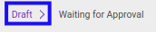
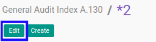
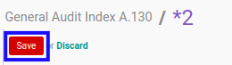

# Memodifikasi Index A.130

## A. INPUT

* Data *Index A.130* yang dapat dimodifikasi harus memiliki status **Draft**.

* User yang akan memodifikasi harus memiliki akses untuk memodifikasi *Index A.130*.

## B. LANGKAH KERJA

1. Buka menu **Accountant Service -> General Audit -> Risk Assessment-> Index A.130**. Abaikan jika sudah berada pada menu yang dimaksud.
2. Buka data *Index A.130* yang akan dimodifikasi. Abaikan jika data sudah dibuka.
3. Klik tombol **Edit** pada bagian atas-kiri form.

4. Ubah **[# Document](./penjelasan.md#field-no-document)** dengan penomeran yang dikehendaki. Biarkan berisi **/** apabila menghendaki penomeran otomatis.
5. Pilih dan sesuaikan **[# General Audit](./penjelasan.md#field-no-general-audit)** jika dibutuhkan. Wajib diisi.
6. Pilih dan sesuaikan **[Responsible](./penjelasan.md#field-responsible)** jika dibutuhkan. Wajib diisi.
7. Beralih ke tab **[Question](./penjelasan.md#tab-question)**.
8. Pilih dan sesuaikan **[Penanggalan surat sesuai dengan tanggal yang disepakati](./penjelasan.md#field-question-1)** jika dibutuhkan. Tidak wajib diisi.
9. Pilih dan sesuaikan **[Penomoran surat sesuai dengan tertib administrasi yang berlaku](./penjelasan.md#field-question-2)** jika dibutuhkan. Tidak wajib diisi.
10. Pilih dan sesuaikan **[Penjelasan tujuan dan ruang lingkup audit](./penjelasan.md#field-question-3)** jika dibutuhkan. Tidak wajib diisi.
11. Pilih dan sesuaikan **[Penyusunan laporan keuangan sesuai kerangka pelaporan keuangan yang berlaku](./penjelasan.md#field-question-4)** jika dibutuhkan. Tidak wajib diisi.
12. Pilih dan sesuaikan **[Pengendalian internal agar laporan keuangan bebas dari salah saji material](./penjelasan.md#field-question-5)** jika dibutuhkan. Tidak wajib diisi.
13. Pilih dan sesuaikan **[Memberikan Auditor Akses ke semua informasi yang relevan](./penjelasan.md#field-question-6)** jika dibutuhkan. Tidak wajib diisi.
14. Pilih dan sesuaikan **[Memberikan Auditor Informasi tambahan yang diperlukan](./penjelasan.md#field-question-7)** jika dibutuhkan. Tidak wajib diisi.
15. Pilih dan sesuaikan **[Memberikan Auditor Akses ke semua personel](./penjelasan.md#field-question-8)** jika dibutuhkan. Tidak wajib diisi.
16. Pilih dan sesuaikan **[Bentuk komunikasi yang diharapkan dalam penyampaian hasil audit](./penjelasan.md#field-question-9)** jika dibutuhkan. Tidak wajib diisi.
17. Pilih dan sesuaikan **[Ekspektasi penyampaian representasi tertulis](./penjelasan.md#field-question-10)** jika dibutuhkan. Tidak wajib diisi.
18. Pilih dan sesuaikan **[Penyediaan draft laporan keuangan tepat waktu](./penjelasan.md#field-question-11)** jika dibutuhkan. Tidak wajib diisi.
19. Pilih dan sesuaikan **[Pengacuan ke bentuk dan isi laporan yang akan dikeluarkan oleh auditor dan suatu pernyataan bahwa..](./penjelasan.md#field-question-12)** jika dibutuhkan. Tidak wajib diisi.
20. Pilih dan sesuaikan **[Klausul kerahasiaan kecuali diminta oleh Hukum/Regulator/Asosiasi Profesi](./penjelasan.md#field-question-13)** jika dibutuhkan. Tidak wajib diisi.
21. Pilih dan sesuaikan **[Tidak menjanjikan opini wajar tanpa pengecualian](./penjelasan.md#field-question-14)** jika dibutuhkan. Tidak wajib diisi.
22. Pilih dan sesuaikan **[Perhatian khusus terhadap peraturan yang berlaku bagi klien](./penjelasan.md#field-question-15)** jika dibutuhkan. Tidak wajib diisi.
23. Pilih dan sesuaikan **[Status](./penjelasan.md#field-status)** jika dibutuhkan. Tidak wajib diisi.
24. Isi dan sesuaikan **[Conclusion](./penjelasan.md#field-conclusion)** jika dibutuhkan. Tidak wajib diisi.
25. Klik tombol **Save** pada bagian atas-kiri form.

## C. OUTPUT

* Data *Index A.130* akan berubah sesuai dengan perubahan yang dilakukan.
