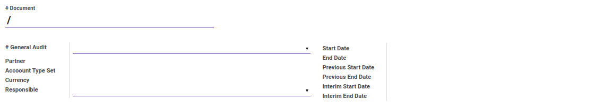
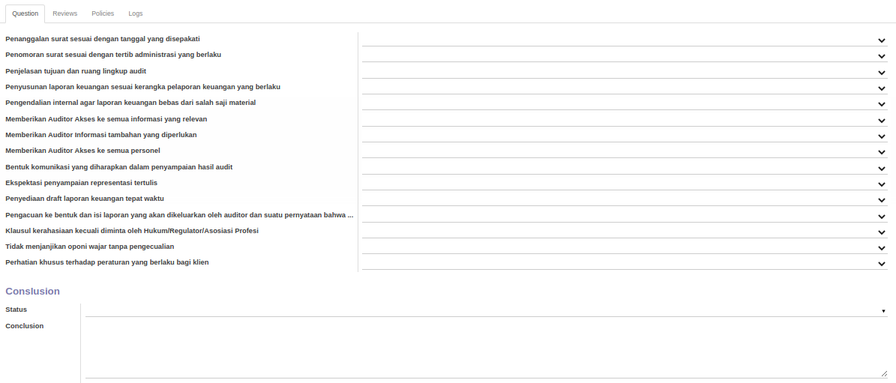
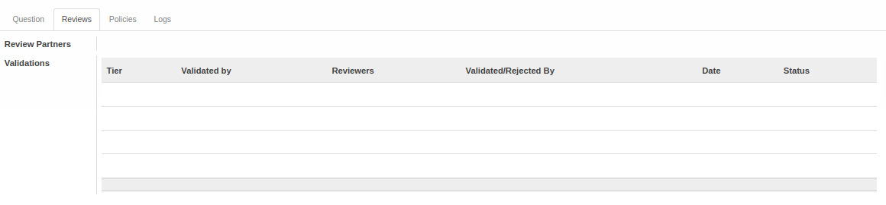
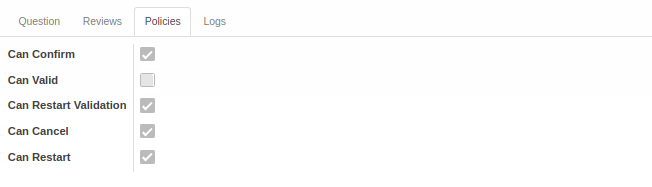
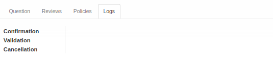

# Penjelasan Index A.130

Informasi pada *Index A.130* dibagi menjadi beberapa bagian, yaitu:

* [Header](#bagian-header)
* [Tab Question](#tab-question)
* [Tab Reviews](#tab-reviews)
* [Tab Policies](#tab-policies)
* [Tab Logs](#tab-logs)

### <a name="bagian-header">HEADER</a>

#### <a name="field-no-document"># Document</a>

Nomor dokumen.

#### <a name="field-no-general-audit"># General Audit</a>

Nomor general audit.

#### <a name="field-partner">Partner</a>

Nama partner.

#### <a name="field-account-type-set">Account Type Set</a>

Set tipe akun yang digunakan.

#### <a name="field-currency">Currency</a>

Mata uang yang digunakan.

#### <a name="field-responsible">Responsible</a>

Nama penanggungjawab.

#### <a name="field-start-date">Start Date</a>

Tanggal awal.

#### <a name="field-end-date">End Date</a>

Tanggal akhir.

#### <a name="field-previous-start-date">Previous Start Date</a>

Tanggal awal sebelumnya.

#### <a name="field-previous-end-date">Previous End Date</a>

Tanggal akhir sebelumnya.

#### <a name="field-interim-start-date">Interim Start Date</a>

Tanggal awal sementara.

#### <a name="field-interim-end-date">Interim End Date</a>

Tanggal akhir sementara.

#### <a name="tab-question">TAB QUESTION</a>

#### <a name="field-question-1">Penanggalan surat sesuai dengan tanggal yang disepakati</a>

Penanggalan surat sesuai dengan tanggal yang disepakati.

#### <a name="field-question-2">Penomoran surat sesuai dengan tertib administrasi yang berlaku</a>

Penomoran surat sesuai dengan tertib administrasi yang berlaku.

#### <a name="field-question-3">Penjelasan tujuan dan ruang lingkup audit</a>

Penjelasan tujuan dan ruang lingkup audit.

#### <a name="field-question-4">Penyusunan laporan keuangan sesuai kerangka pelaporan keuangan yang berlaku</a>

Penyusunan laporan keuangan sesuai kerangka pelaporan keuangan yang berlaku.

#### <a name="field-question-5">Pengendalian internal agar laporan keuangan bebas dari salah saji material</a>

Pengendalian internal agar laporan keuangan bebas dari salah saji material.

#### <a name="field-question-6">Memberikan Auditor Akses ke semua informasi yang relevan</a>

Memberikan Auditor Akses ke semua informasi yang relevan.

#### <a name="field-question-7">Memberikan Auditor Informasi tambahan yang diperlukan</a>

Memberikan Auditor Informasi tambahan yang diperlukan.

#### <a name="field-question-8">Memberikan Auditor Akses ke semua personel</a>

Memberikan Auditor Akses ke semua personel.

#### <a name="field-question-9">Bentuk komunikasi yang diharapkan dalam penyampaian hasil audit</a>

Bentuk komunikasi yang diharapkan dalam penyampaian hasil audit.

#### <a name="field-question-10">Ekspektasi penyampaian representasi tertulis</a>

Ekspektasi penyampaian representasi tertulis.

#### <a name="field-question-11">Penyediaan draft laporan keuangan tepat waktu</a>

Penyediaan draft laporan keuangan tepat waktu.

#### <a name="field-question-12">Pengacuan ke bentuk dan isi laporan yang akan dikeluarkan oleh auditor dan suatu pernyataan bahwa..</a>

Pengacuan ke bentuk dan isi laporan yang akan dikeluarkan oleh auditor dan suatu pernyataan bahwa dalam kondisi tertentu terdapat kenungkinan laporan yang dikeluarkan berbeda bentuk dan isinya dengan yang diharapkan.

#### <a name="field-question-13">Klausul kerahasiaan kecuali diminta oleh Hukum/Regulator/Asosiasi Profesi</a>

Klausul kerahasiaan kecuali diminta oleh Hukum/Regulator/Asosiasi Profesi.

#### <a name="field-question-14">Tidak menjanjikan opini wajar tanpa pengecualian</a>

Tidak menjanjikan opini wajar tanpa pengecualian.

#### <a name="field-question-15">Perhatian khusus terhadap peraturan yang berlaku bagi klien</a>

Perhatian khusus terhadap peraturan yang berlaku bagi klien.

***Conclusion***

#### <a name="field-status">Status</a>

Status.

#### <a name="field-conclusion">Conclusion</a>

Kesimpulan.

#### <a name="tab-reviews">TAB REVIEWS</a>

#### <a name="field-review-partners-validations">Review Partners Validations</a>

Nama-nama user yang dapat menyetujui/menolak *Index A.130*

#### <a name="tabel-validations">TABEL Validations</a>

Tahapan-tahapan persetujuan *Index A.130*

#### <a name="field-validations-tier">Tier</a>

Urutan persetujuan

#### <a name="field-validations-validated-by">Validated By</a>

Metode pemilihan user-user yang dapat menyetujui/menolak *Index A.130*. Metode pemilihan terdiri dari 3 (tiga) yaitu:

1. *Specific user*. User-user yang dapat menyetujui/menolak *Index A.130* ditentukan langsung.
2. *Any user in specific group*. User-user yang dapat menyetujui/menolak *Index A.130* adalah user-user yang tergabung dalam kelompok-kelompok user yang ditentukan.
3. *Both specific user and group*. User-user yang dapat menyetujui/menolak *Index A.130* ditentukan langsung ditambah dengan user-user yang tergabung dalam kelompok-kelompok user yang ditentukan.
4. *Python code*. User-user yang dapat menyetujui/menolak *Index A.130* ditentukan oleh algoritma kode python tertentu

#### <a name="field-validations-reviewers">Reviewers</a>

Nama-nama user yang dapat menyetujui/menolak *Index A.130* pada *tier* yang dimaksud.

#### <a name="field-validations-validated-rejected">Validated/Rejected By</a>

User yang menyetujui/menolak *Index A.130*.

#### <a name="field-validations-date">Date</a>

Tanggal dan waktu **Validated/Rejected By** menyetujui/menolak *Index A.130*

#### <a name="field-validations-date">Status</a>

Status persetujuan, terdiri dari 2 (dua) kemungkinan:

1. **Approved**. Tier disetujui.
2. **Rejected**. Tier ditolak.

#### <a name="tab-policies">TAB POLICIES</a>

#### <a name="field-confirm">Can Confirm</a>

Berhak/tidaknya user aktif untuk dapat mengkonfirmasi Index A.130.

#### <a name="field-valid">Can Valid</a>

Berhak/tidaknya user aktif untuk dapat menyetujui Index A.130.

#### <a name="field-restart-validation">Can Restart Validation</a>

Berhak/tidaknya user aktif untuk dapat merestart persetujuan Index A.130.

#### <a name="field-cancel">Can Cancel</a>

Berhak/tidaknya user aktif untuk dapat membatalkan Index A.130.

#### <a name="field-restart">Can Restart</a>

Berhak/tidaknya user aktif untuk dapat merestart Index A.130.

#### <a name="tab-logs">TAB LOGS</a>

#### <a name="field-confirmation">Confirmation</a>

Waktu konfirmasi dan user yang mengkonfirmasi Index A.130.

#### <a name="field-validation">Validation</a>

Waktu persetujuan dan user yang menyetujui Index A.130.

#### <a name="field-cancellation">Cancellation</a>

Waktu batal dan user yang membatalkan Index A.130.
