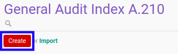

# Membuat Index A.210

## A. INPUT

*(Tidak ada instruksi khusus)*

## B. LANGKAH KERJA

1. Buka menu **Accountant Service -> General Audit -> Risk Assessment-> Index A.210**. Abaikan jika sudah berada pada menu yang dimaksud.
2. Klik tombol **Create** pada bagian atas-kiri form.

3. Ubah **[# Document](./penjelasan.md#field-no-document)** dengan penomeran yang dikehendaki. Biarkan berisi **/** apabila menghendaki penomeran otomatis.
4. Pilih **[# General Audit](./penjelasan.md#field-no-general-audit)**. Wajib diisi.
5. Pilih **[Responsible](./penjelasan.md#field-responsible)**. Wajib diisi.
6. Beralih ke tab **[Materiality](./penjelasan.md#tab-materiality)**.
7. Pilih **[Computation Item To Use](./penjelasan.md#field-computation-item)**. Tidak wajib diisi.
8. Isi **[Other Base Amount](./penjelasan.md#field-other-base-amount)**. Wajib diisi.
9. Isi **[Percentage](./penjelasan.md#field-overall-percentage)**. Wajib diisi.
10. Isi **[Consideration](./penjelasan.md#field-overall-consideration)**. Tidak wajib diisi.
11. Isi **[Percentage](./penjelasan.md#field-performance-percentage)**. Wajib diisi.
12. Isi **[Consideration](./penjelasan.md#field-performance-consideration)**. Tidak wajib diisi.
13. Isi **[Percentage](./penjelasan.md#field-tolerable-percentage)**. Wajib diisi.
14. Isi **[Consideration](./penjelasan.md#field-tolerable-consideration)**. Tidak wajib diisi.
15. Pilih **[Status](./penjelasan.md#field-status)**. Tidak wajib diisi.
16. Isi **[Conclusion](./penjelasan.md#field-conclusion)**. Tidak wajib diisi.
17. Klik tombol **Save** pada bagian atas-kiri form.

## C. OUTPUT

* Data *Index A.210* akan terbuat dengan status **Draft**

