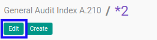
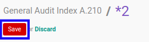

# Memodifikasi Index A.210

## A. INPUT

* Data *Index A.210* yang dapat dimodifikasi harus memiliki status **Draft**.

* User yang akan memodifikasi harus memiliki akses untuk memodifikasi *Index A.210*.

## B. LANGKAH KERJA

1. Buka menu **Accountant Service -> General Audit -> Risk Assessment-> Index A.210**. Abaikan jika sudah berada pada menu yang dimaksud.
2. Buka data *Index A.210* yang akan dimodifikasi. Abaikan jika data sudah dibuka.
3. Klik tombol **Edit** pada bagian atas-kiri form.

4. Ubah **[# Document](./penjelasan.md#field-no-document)** dengan penomeran yang dikehendaki. Biarkan berisi **/** apabila menghendaki penomeran otomatis.
5. Pilih dan sesuaikan **[# General Audit](./penjelasan.md#field-no-general-audit)** jika dibutuhkan. Wajib diisi.
6. Pilih dan sesuaikan **[Responsible](./penjelasan.md#field-responsible)** jika dibutuhkan. Wajib diisi.
7. Beralih ke tab **[Materiality](./penjelasan.md#tab-materiality)**.
8. Pilih dan sesuaikan **[Computation Item To Use](./penjelasan.md#field-computation-item)** jika dibutuhkan. Tidak wajib diisi.
9. Isi dan sesuaikan **[Other Base Amount](./penjelasan.md#field-other-base-amount)** jika dibutuhkan. Wajib diisi.
10. Isi dan sesuaikan **[Percentage](./penjelasan.md#field-overall-percentage)** jika dibutuhkan. Wajib diisi.
11. Isi dan sesuaikan **[Consideration](./penjelasan.md#field-overall-consideration)** jika dibutuhkan. Tidak wajib diisi.
12. Isi dan sesuaikan **[Percentage](./penjelasan.md#field-performance-percentage)** jika dibutuhkan. Wajib diisi.
13. Isi dan sesuaikan **[Consideration](./penjelasan.md#field-performance-consideration)** jika dibutuhkan. Tidak wajib diisi.
14. Isi dan sesuaikan **[Percentage](./penjelasan.md#field-tolerable-percentage)** jika dibutuhkan. Wajib diisi.
15. Isi dan sesuaikan **[Consideration](./penjelasan.md#field-tolerable-consideration)** jika dibutuhkan. Tidak wajib diisi.
16. Pilih dan sesuaikan **[Status](./penjelasan.md#field-status)** jika dibutuhkan. Tidak wajib diisi.
17. Isi dan sesuaikan **[Conclusion](./penjelasan.md#field-conclusion)** jika dibutuhkan. Tidak wajib diisi.
18. Klik tombol **Save** pada bagian atas-kiri form.

## C. OUTPUT

* Data *Index A.210* akan berubah sesuai dengan perubahan yang dilakukan.
