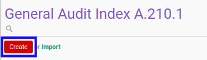
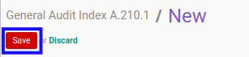
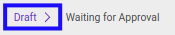

# Membuat Index A.210.1

## A. INPUT

*(Tidak ada instruksi khusus)*

## B. LANGKAH KERJA

1. Buka menu **Accountant Service -> General Audit -> Risk Assessment-> Index A.210.1**. Abaikan jika sudah berada pada menu yang dimaksud.
2. Klik tombol **Create** pada bagian atas-kiri form.

3. Ubah **[# Document](./penjelasan.md#field-no-document)** dengan penomeran yang dikehendaki. Biarkan berisi **/** apabila menghendaki penomeran otomatis.
4. Pilih **[# General Audit](./penjelasan.md#field-no-general-audit)**. Wajib diisi.
5. Pilih **[Responsible](./penjelasan.md#field-responsible)**. Wajib diisi.
6. Beralih ke tab **[Materiality](./penjelasan.md#tab-materiality)**.
7. Pilih **[Materiality Type](./penjelasan.md#field-materiality-type)**. Wajib diisi.
8. <a name="l8">[Modifikasi](./memodifikasi-materiality.md) **Materiality**</a>. Ulangi langkah ini sampai **Materiality** sesuai dengan keinginan.
9. Pilih **[Status](./penjelasan.md#field-status)**. Tidak wajib diisi.
10. Isi **[Conclusion](./penjelasan.md#field-conclusion)**. Tidak wajib diisi.
11. Klik tombol **Save** pada bagian atas-kiri form.

## C. OUTPUT

* Data *Index A.2101* akan terbuat dengan status **Draft**

