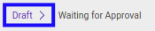

# Memodifikasi Index A.210.1

## A. INPUT

* Data *Index A.210.1* yang dapat dimodifikasi harus memiliki status **Draft**.

* User yang akan memodifikasi harus memiliki akses untuk memodifikasi *Index A.210.1*.

## B. LANGKAH KERJA

1. Buka menu **Accountant Service -> General Audit -> Risk Assessment-> Index A.210.1**. Abaikan jika sudah berada pada menu yang dimaksud.
2. Buka data *Index A.210.1* yang akan dimodifikasi. Abaikan jika data sudah dibuka.
3. Klik tombol **Edit** pada bagian atas-kiri form.

4. Ubah **[# Document](./penjelasan.md#field-no-document)** dengan penomeran yang dikehendaki. Biarkan berisi **/** apabila menghendaki penomeran otomatis.
5. Pilih dan sesuaikan **[# General Audit](./penjelasan.md#field-no-general-audit)** jika dibutuhkan. Wajib diisi.
6. Pilih dan sesuaikan **[Responsible](./penjelasan.md#field-responsible)** jika dibutuhkan. Wajib diisi.
7. Beralih ke tab **[Materiality](./penjelasan.md#tab-materiality)**.
8. Pilih dan sesuaikan **[Materiality Type](./penjelasan.md#field-materiality-type)** jika dibutuhkan. Wajib diisi.
9. <a name="l9">[Modifikasi](./memodifikasi-materiality.md) **Materiality**</a>. Ulangi langkah ini sampai **Materiality** sesuai dengan keinginan.
10. Pilih dan sesuaikan **[Status](./penjelasan.md#field-status)** jika dibutuhkan. Tidak wajib diisi.
11. Isi dan sesuaikan **[Conclusion](./penjelasan.md#field-conclusion)** jika dibutuhkan. Tidak wajib diisi.
12. Klik tombol **Save** pada bagian atas-kiri form.

## C. OUTPUT

* Data *Index A.210.1* akan berubah sesuai dengan perubahan yang dilakukan.
