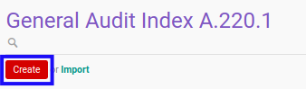

# Membuat Index A.220.1

## A. INPUT

*(Tidak ada instruksi khusus)*

## B. LANGKAH KERJA

1. Buka menu **Accountant Service -> General Audit -> Risk Assessment-> Index A.220.1**. Abaikan jika sudah berada pada menu yang dimaksud.
2. Klik tombol **Create** pada bagian atas-kiri form.

3. Ubah **[# Document](./penjelasan.md#field-no-document)** dengan penomeran yang dikehendaki. Biarkan berisi **/** apabila menghendaki penomeran otomatis.
4. Pilih **[# General Audit](./penjelasan.md#field-no-general-audit)**. Wajib diisi.
5. Pilih **[Responsible](./penjelasan.md#field-responsible)**. Wajib diisi.
6. Beralih ke tab **[Analysis](./penjelasan.md#tab-analysis)**.
7. <a name="l7">[Modifikasi](./memodifikasi-analysis.md) **Analysis**</a>. Ulangi langkah ini sampai **Analysis** sesuai dengan keinginan.
8. Klik tombol **Save** pada bagian atas-kiri form.

## C. OUTPUT

* Data *Index A.2201* akan terbuat dengan status **Draft**

