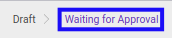
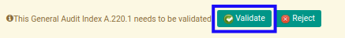
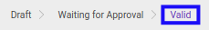

# Menyetujui Index A.220.1

* Data *Index A.220.1* yang akan disetujui harus memiliki status **Waiting for Approval**.

* User yang akan menyetujui harus memiliki akses untuk menyetujui *Index A.220.1*.

## B. LANGKAH KERJA

1. Buka menu **Accountant Service -> General Audit -> Risk Assessment-> Index A.220.1**. Abaikan jika sudah berada pada menu yang dimaksud.
2. Buka data *Index A.220.1* yang akan disetujui. Abaikan jika data sudah dibuka.
3. Klik tombol **Validate** pada bagian atas-kiri form.

## C. OUTPUT

* Status dari *Index A.220.1* akan berubah menjadi **Valid**.

