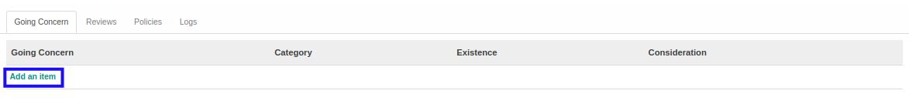

# Menambahkan Going Concern

*(Instruksi kerja ini merupakan sub instruksi dari (1) [Membuat Index A.230.6](./membuat.md), atau (2) [Memodifikasi Index A.230.6](./memodifikasi.md). Instruksi kerja ini tidak bisa berdiri sendiri)*

## A. INPUT

*(Tidak ada instruksi khusus)*

## B. LANGKAH KERJA

1. Klik label **Add an Item** pada bagian atas-kiri tabel ***Going Concern***

2. Pilih **[Going Concern](./penjelasan.md#field-going-concern)**. Tidak wajib diisi.
3. Pilih **[Existence](./penjelasan.md#field-existence)**. Wajib diisi.
4. Isi **[Consideration](./penjelasan.md#field-consideration)**. Tidak wajib diisi.
5. Klik tombol **Save & Close** pada bagian bawah-kiri pop-up **Going Concern** untuk menyimpan data. Klik tombol **Save & New** pada bagian bawah-kiri pop-up **Going Concern** untuk menyimpan data dan menambahkan data baru.

6. Ulangi mulai langkah ke-2 jika pada langkah ke-5 tombol **Save & New** yang dipilih.
7. Lanjutkan [langkah ke-7 instruksi kerja Membuat Index A.230.6](./membuat.md#l7) atau [langkah ke-8 instruksi kerja Memodifikasi Index A.230.6](./memodifikasi.md#l8).

## C. OUTPUT

*(Tidak ada instruksi khusus)*
