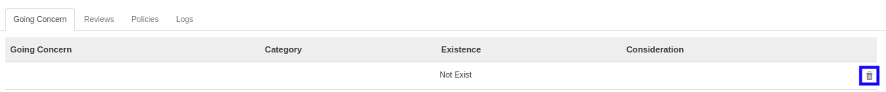

# Menghapus Going Concern

*(Instruksi kerja ini merupakan sub instruksi dari (1) [Membuat Index A.230.6](./membuat.md), atau (2) [Memodifikasi Index A.230.6](./memodifikasi.md). Instruksi kerja ini tidak bisa berdiri sendiri)*

## A. INPUT

*(Tidak ada instruksi khusus)*

## B. LANGKAH KERJA

1. Klik icon tempat sampah pada bagian kanan data **Going Concern** yang akan dihapus.

2. Lanjutkan [langkah ke-7 instruksi kerja Membuat Index A.230.6](./membuat.md#l7) atau [langkah ke-8 instruksi kerja Memodifikasi Index A.230.6](./memodifikasi.md#l8).

## C. OUTPUT

*(Tidak ada instruksi khusus)*
