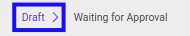
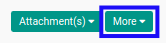
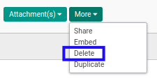
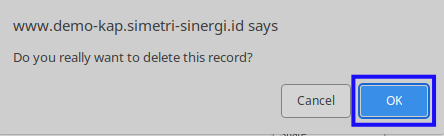

# Menghapus Index A.230.6

## A. INPUT

* Data *Index A.230.6* yang dapat dihapus harus memiliki status **Draft**.

* User yang akan menghapus harus memiliki akses untuk menghapus *Index A.230.6*.
* Nomor dokumen harus sama dengan /

## B. LANGKAH KERJA

1. Buka menu **Accountant Service -> General Audit -> Risk Assessment-> Index A.230.6**. Abaikan jika sudah berada pada menu yang dimaksud.
2. Buka data *Index A.230.6* yang akan dihapus. Abaikan jika data sudah dibuka.
3. Klik tombol **More** pada bagian atas-tengah form.

4. Klik tombol **Delete** pada *dropdown* yang muncul ketika tombol **More** diklik.

5. Klik tombol **Ok** pada *pop-up* konfirmasi penghapusan yang muncul.

## C. OUTPUT

* Data *Index A.230.6* akan terhapus.
