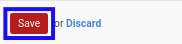

# Memodifikasi Fraud

*(Instruksi kerja ini merupakan sub instruksi dari (1) [Membuat Index A.230.8](./membuat.md), atau (2) [Memodifikasi Index A.230.8](./memodifikasi.md). Instruksi kerja ini tidak bisa berdiri sendiri)*

## A. INPUT

*(Tidak ada instruksi khusus)*

## B. LANGKAH KERJA

1. Buka data **Fraud** yang akan dimodifikasi.
2. Pilih dan sesuaikan **[Fraud Inquiry](./penjelasan.md#field-fraud-inquiry)** jika dibutuhkan. Wajib diisi.
3. Isi dan sesuaikan **[TCWG Respon](./penjelasan.md#field-tcwg-respon)** jika dibutuhkan. Tidak wajib diisi.
4. Isi dan sesuaikan **[Management Respon](./penjelasan.md#field-management-respon)** jika dibutuhkan. Tidak wajib diisi.
5. Isi dan sesuaikan **[Other Respon](./penjelasan.md#field-other-respon)** jika dibutuhkan. Tidak wajib diisi.
6. Pilih dan sesuaikan **[Account Type](./penjelasan.md#field-account-type)** jika dibutuhkan. Tidak wajib diisi.
7. Klik tombol **Save** pada bagian bawah-kiri form.

8. Lanjutkan [langkah ke-7 instruksi kerja Membuat Index A.230.8](./membuat.md#l7) atau [langkah ke-8 instruksi kerja Memodifikasi Index A.230.8](./memodifikasi.md#l8).

## C. OUTPUT

*(Tidak ada instruksi khusus)*
