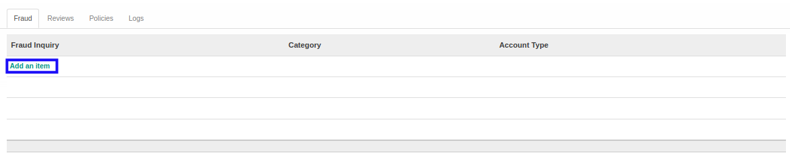

# Menambahkan Fraud

*(Instruksi kerja ini merupakan sub instruksi dari (1) [Membuat Index A.230.8](./membuat.md), atau (2) [Memodifikasi Index A.230.8](./memodifikasi.md). Instruksi kerja ini tidak bisa berdiri sendiri)*

## A. INPUT

*(Tidak ada instruksi khusus)*

## B. LANGKAH KERJA

1. Klik label **Add an Item** pada bagian atas-kiri tabel ***Fraud Inquiry***

2. Pilih **[Fraud Inquiry](./penjelasan.md#field-fraud-inquiry)**. Wajib diisi.
3. Isi **[TCWG Respon](./penjelasan.md#field-tcwg-respon)**. Tidak wajib diisi.
4. Isi **[Management Respon](./penjelasan.md#field-management-respon)**. Tidak wajib diisi.
5. Isi **[Other Respon](./penjelasan.md#field-other-respon)**. Tidak wajib diisi.
6. Pilih **[Account Type](./penjelasan.md#field-account-type)**. Tidak wajib diisi.
7. Klik tombol **Save & Close** pada bagian bawah-kiri pop-up **Fraud Inquiry** untuk menyimpan data. Klik tombol **Save & New** pada bagian bawah-kiri pop-up **Fraud Inquiry** untuk menyimpan data dan menambahkan data baru.

8. Ulangi mulai langkah ke-2 jika pada langkah ke-7 tombol **Save & New** yang dipilih.
9. Lanjutkan [langkah ke-7 instruksi kerja Membuat Index A.230.8](./membuat.md#l7) atau [langkah ke-8 instruksi kerja Memodifikasi Index A.230.8](./memodifikasi.md#l8).

## C. OUTPUT

*(Tidak ada instruksi khusus)*
