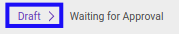

# Merestart Index A.230.8

* Data *Index A.230.8* yang akan direstart harus memiliki status **Cancelled**.

* User yang akan merestart harus memiliki akses untuk merestart *Index A.230.8*.

## B. LANGKAH KERJA

1. Buka menu **Accountant Service -> General Audit -> Risk Assessment-> Index A.230.8**. Abaikan jika sudah berada pada menu yang dimaksud.
2. Buka data *Index A.230.8* yang akan direstart. Abaikan jika data sudah dibuka.
3. Klik tombol **Restart** pada bagian atas-kiri form.

4. Klik tombol **Ok** pada *pop-up* konfirmasi restart yang muncul.

## C. OUTPUT

* Status dari *Index A.230.8* akan berubah menjadi **Draft**.

* *Index A.230.8* dapat kembali dimodifikasi.
