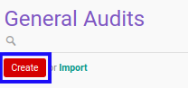

# Membuat General Audit

## A. INPUT

*(Tidak ada instruksi khusus)*

## B. LANGKAH KERJA

1. Buka menu **Accountant Service -> General Audit -> General Audits**. Abaikan jika sudah berada pada menu yang dimaksud.
2. Klik tombol **Create** pada bagian atas-kiri form.

3. Ubah **[# Document](./penjelasan.md#field-no-document)** dengan penomeran yang dikehendaki. Biarkan berisi **/** apabila menghendaki penomeran otomatis.
4. Pilih **[Partner](./penjelasan.md#field-partner)**. Wajib diisi.
5. Pilih **[Sector](./penjelasan.md#field-sector)**. Wajib diisi.
6. Pilih **[Account Type Set](./penjelasan.md#field-account-type-set)**. Wajib diisi.
7. Pilih **[Financial Accounting Standard](./penjelasan.md#field-financial-accounting-standard)**. Wajib diisi.
8. Pilih **[Currency](./penjelasan.md#field-currency)**. Wajib diisi.
9. Pilih **[Responsible](./penjelasan.md#field-responsible)**. Wajib diisi.
10. Pilih **[Accountant](./penjelasan.md#field-accountant)**. Wajib diisi.
11. Isi **[Num. of Consecutive Audit (Firm)](./penjelasan.md#field-num-audit-firm)**. Wajib diisi.
12. Isi **[Num. of Consecutive Audit (Accountant)](./penjelasan.md#field-num-audit-accountant)**. Wajib diisi.
13. Pilih **[Start Date](./penjelasan.md#field-start-date)**. Wajib diisi.
14. Pilih **[End Date](./penjelasan.md#field-end-date)**. Wajib diisi.
15. Pilih **[Previous Start Date](./penjelasan.md#field-previous-start-date)**. Wajib diisi.
16. Pilih **[Previous End Date](./penjelasan.md#field-previous-end-date)**. Wajib diisi.
17. Pilih **[Interim Start Date](./penjelasan.md#field-interim-start-date)**. Wajib diisi.
18. Pilih **[Interim End Date](./penjelasan.md#field-interim-end-date)**. Wajib diisi.
19. Klik tombol **Save** pada bagian atas-kiri form.

## C. OUTPUT

* Data *General Audit* akan terbuat.
