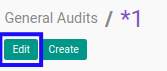
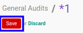

# Memodifikasi General Audit

## A. INPUT

* Data *General Audit* yang dapat dimodifikasi harus memiliki status **Draft**.

* User yang akan memodifikasi harus memiliki akses untuk memodifikasi *General Audit*.

## B. LANGKAH KERJA

1. Buka menu **Accountant Service -> General Audit -> General Audits**. Abaikan jika sudah berada pada menu yang dimaksud.
2. Buka data *General Audit* yang akan dimodifikasi. Abaikan jika data sudah dibuka.
3. Klik tombol **Edit** pada bagian atas-kiri form.

4. Ubah **[# Document](./penjelasan.md#field-no-document)** dengan penomeran yang dikehendaki. Biarkan berisi **/** apabila menghendaki penomeran otomatis.
5. Pilih dan sesuaikan **[Partner](./penjelasan.md#field-partner)** jika dibutuhkan. Wajib diisi.
6. Pilih dan sesuaikan **[Sector](./penjelasan.md#field-sector)** jika dibutuhkan. Wajib diisi.
7. Pilih dan sesuaikan **[Account Type Set](./penjelasan.md#field-account-type-set)** jika dibutuhkan. Wajib diisi.
8. Pilih dan sesuaikan **[Financial Accounting Standard](./penjelasan.md#field-financial-accounting-standard)** jika dibutuhkan. Wajib diisi.
9. Pilih dan sesuaikan **[Currency](./penjelasan.md#field-currency)** jika dibutuhkan. Wajib diisi.
10. Pilih dan sesuaikan **[Responsible](./penjelasan.md#field-responsible)** jika dibutuhkan. Wajib diisi.
11. Pilih dan sesuaikan **[Accountant](./penjelasan.md#field-accountant)** jika dibutuhkan. Wajib diisi.
12. Isi dan sesuaikan **[Num. of Consecutive Audit (Firm)](./penjelasan.md#field-num-audit-firm)** jika dibutuhkan. Wajib diisi.
13. Isi dan sesuaikan **[Num. of Consecutive Audit (Accountant)](./penjelasan.md#field-num-audit-accountant)** jika dibutuhkan. Wajib diisi.
14. Pilih dan sesuaikan **[Start Date](./penjelasan.md#field-start-date)** jika dibutuhkan. Wajib diisi.
15. Pilih dan sesuaikan **[End Date](./penjelasan.md#field-end-date)** jika dibutuhkan. Wajib diisi.
16. Pilih dan sesuaikan **[Previous Start Date](./penjelasan.md#field-previous-start-date)** jika dibutuhkan. Wajib diisi.
17. Pilih dan sesuaikan **[Previous End Date](./penjelasan.md#field-previous-end-date)** jika dibutuhkan. Wajib diisi.
18. Pilih dan sesuaikan **[Interim Start Date](./penjelasan.md#field-interim-start-date)** jika dibutuhkan. Wajib diisi.
19. Pilih dan sesuaikan **[Interim End Date](./penjelasan.md#field-interim-end-date)** jika dibutuhkan. Wajib diisi.
20. Klik tombol **Save** pada bagian atas-kiri form.

## C. OUTPUT

* Data *General Audit* akan berubah sesuai dengan perubahan yang dilakukan.
