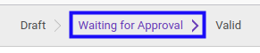
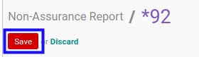
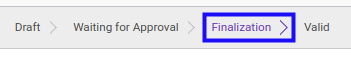

# Melakukan Finalisasi Non-Assurance Report

* Data Non-Assurance Report yang akan dilakukan finalisasi harus memiliki status **Waiting For Approval**.

## B. INSTRUKSI KERJA

1. Buka menu **Accountant Report -> Accountant Report -> Non-Assurance**. Abaikan jika sudah berada pada menu yang dimaksud.
2. Buka data *Non-Assurance Report* yang akan dilakukan finalisasi. Abaikan jika data sudah dibuka.
3. Klik tombol **Edit** pada bagian atas-kiri form.

4. Beralih ke tab [Quality Control](./penjelasan.md#tab-quality-control)
5. Jawab pertanyaan tiap data item **[Question](./penjelasan.md#field-question)** pada tabel **[Quality Control](./penjelasan.md#tab-quality-control)**. <a name="l5">[Pilih jawaban](./memilih-jawaban-qualitative.md) apabila isian **Type** == Qualitative atau <a name="l5">[Isi jawaban](./mengisi-jawaban-quantitative.md) jika isian **Type** == Quantitative. Ulangi sampai semua jawaban sesuai dengan keadaan.
6. Klik tombol **Save** pada bagian atas-kiri form.

7. Klik tombol **Finalization** pada bagian atas-kiri form.

## C. OUTPUT

* Status *Non-Assurance Report* akan berubah menjadi **Finalization** jika seluruh jawaban atas item pertanyaan **[Success?](./penjelasan.md#field-question)** telah sesuai.

