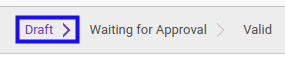
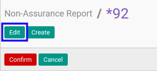
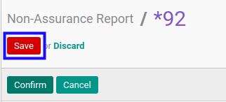

# Memodifikasi Non-Assurance Report

## A. INPUT

* Data *Non-Assurance Report* yang dapat dimodifikasi harus memiliki status **Draft**.

* User yang akan memodifikasi harus memiliki akses untuk memodifikasi *Non-Assurance Report*.

## B. LANGKAH KERJA

1. Buka menu **Accountant Report -> Accountant Report -> Non-Assurance**. Abaikan jika sudah berada pada menu yang dimaksud.
2. Buka data *Non-Assurance Report* yang akan dimodifikasi. Abaikan jika data sudah dibuka.
3. Klik tombol **Edit** pada bagian atas-kiri form.

4. Ubah **[# Report](./penjelasan.md#field-no-report)** dengan penomeran yang dikehendaki. Biarkan berisi **/** apabila menghendaki penomeran otomatis.
5. Pilih dan sesuaikan **[Operating Unit](./penjelasan.md#field-operating-unit)** jika dibutuhkan. Tidak wajib diisi.
6. Pilih dan sesuaikan **[Operating Unit Partner](./penjelasan.md#field-operating-unit-partner)** jika dibutuhkan. Tidak wajib diisi.
7. Pilih dan sesuaikan **[Customer](./penjelasan.md#field-customer)** jika dibutuhkan. Wajib diisi.
8. Pilih dan sesuaikan **[Project](./penjelasan.md#field-project)** jika dibutuhkan. Tidak wajib diisi.
9. Pilih dan sesuaikan **[Date Start](./penjelasan.md#field-date-start)** jika dibutuhkan. Wajib diisi.
10. Pilih dan sesuaikan **[Date End](./penjelasan.md#field-date-end)** jika dibutuhkan. Wajib diisi.
11. Pilih dan sesuaikan **[Accountant Service](./penjelasan.md#field-accountant-service)** jika dibutuhkan. Wajib diisi.
12. Isi dan sesuaikan **[Subsequent Job Num](./penjelasan.md#field-subsequent-job)** jika dibutuhkan. Tidak wajib diisi.
13. Pilih dan sesuaikan **[Restatement Report](./penjelasan.md#field-restatement-report)** jika dibutuhkan. Tidak wajib diisi.
14. Aktifkan/ Deaktifkan **[Method Required](./penjelasan.md#field-method-required)** jika dibutuhkan. Wajib/tidak diisi tergantung dari accountant service yang dipilih.
15. Pilih dan sesuaikan **[Method](./penjelasan.md#field-method)** jika dibutuhkan. Tidak wajib diisi.
16. Pilih dan sesuaikan **[Date](./penjelasan.md#field-date)** jika dibutuhkan. Wajib diisi.
17. Pilih dan sesuaikan **[Signing Accountant](./penjelasan.md#field-signing-accountant)** jika dibutuhkan. Wajib diisi.
18. Aktifkan/ Deaktifkan **[Opinion Required](./penjelasan.md#field-opinion-required)** jika dibutuhkan. Tidak wajib diisi.
19. Pilih dan sesuaikan **[Opinion](./penjelasan.md#field-opinion)** jika dibutuhkan. Wajib/tidak diisi tergantung dari accountant service yang dipilih.
20. Pilih dan sesuaikan **[Main Report Attachment](./penjelasan.md#field-main-report-attachment)** jika dibutuhkan. Tidak wajib diisi.
21. Beralih ke tab **[Client Informations](./penjelasan.md#tab-client-informations)**.
22. Pilih dan sesuaikan **[Information Based On](./penjelasan.md#field-information-based-on)** jika dibutuhkan. Tidak wajib diisi.
23. Pilih dan sesuaikan **[Client Currency](./penjelasan.md#field-client-currency)** jika dibutuhkan. Tidak wajib diisi.
24. Isi dan sesuaikan **[Revenue](./penjelasan.md#field-revenue)** jika dibutuhkan. Tidak wajib diisi.
25. Isi dan sesuaikan **[Total Asset](./penjelasan.md#field-total-asset)** jika dibutuhkan. Tidak wajib diisi.
26. Isi dan sesuaikan **[Total Liability](./penjelasan.md#field-total-liability)** jika dibutuhkan. Tidak wajib diisi.
27. Isi dan sesuaikan **[EBIT](./penjelasan.md#field-ebit)** jika dibutuhkan. Tidak wajib diisi.
28. Isi dan sesuaikan **[Tax Expense](./penjelasan.md#field-tax-expense)** jika dibutuhkan. Tidak wajib diisi.
29. Isi dan sesuaikan **[Total Net Profit](./penjelasan.md#field-total-net-profit)** jika dibutuhkan. Tidak wajib diisi.
30. Isi dan sesuaikan **[Total Net Profit & OCI](./penjelasan.md#field-total-net-profit-oci)** jika dibutuhkan. Tidak wajib diisi.
31. Beralih ke tab **[Note](./penjelasan.md#tab-note)**.
32. Isi dan sesuaikan **[Note](./penjelasan.md#field-note)** jika dibutuhkan. Tidak wajib diisi.
33. Beralih ke tab **[Policy](./penjelasan.md#tab-policy)**.
34. Aktifkan/ Deaktifkan **[Can Confirm](./penjelasan.md#field-can-confirm)** jika dibutuhkan. Tidak wajib diisi.
35. Aktifkan/ Deaktifkan **[Can Validate](./penjelasan.md#field-can-validate)** jika dibutuhkan. Tidak wajib diisi.
36. Aktifkan/ Deaktifkan **[Can Cancel](./penjelasan.md#field-can-cancel)** jika dibutuhkan. Tidak wajib diisi.
37. Aktifkan/ Deaktifkan **[Can Restart](./penjelasan.md#field-can-restart)** jika dibutuhkan. Tidak wajib diisi.
38. Klik tombol **Save** pada bagian atas-kiri form.

## C. OUTPUT

* Data *Non-Assurance Report* akan berubah sesuai dengan perubahan yang dilakukan.
