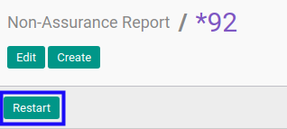

# Merestart Non-Assurance Report

## A. INPUT

* Data *Non-Assurance Report* yang akan direstart harus memiliki status **Cancel**.

* User yang akan merestart harus memiliki akses untuk merestart *Non-Assurance Report*.

## B. LANGKAH KERJA

1. Buka menu **Accountant Report -> Accountant Report -> Non-Assurance**. Abaikan jika sudah berada pada menu yang dimaksud.
2. Buka data *Non-Assurance Report* yang akan direstart. Abaikan jika data sudah dibuka.
3. Klik tombol **Restart** pada bagian atas-kiri form.

## C. OUTPUT

* Status dari *Non-Assurance Report* akan berubah menjadi **Draft**.

* *Non-Assurance Report* dapat kembali dimodifikasi.
