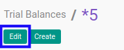
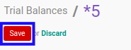

# Memodifikasi Trial Balance

## A. INPUT

* Data *Trial Balance* yang dapat dimodifikasi harus memiliki status **Draft**.

* User yang akan memodifikasi harus memiliki akses untuk memodifikasi *Trial Balance*.

## B. LANGKAH KERJA

1. Buka menu **Accountant Service -> General Audit -> Trial Balances**. Abaikan jika sudah berada pada menu yang dimaksud.
2. Buka data *Trial Balance* yang akan dimodifikasi. Abaikan jika data sudah dibuka.
3. Klik tombol **Edit** pada bagian atas-kiri form.

4. Ubah **[# Document](./penjelasan.md#field-no-document)** dengan penomeran yang dikehendaki. Biarkan berisi **/** apabila menghendaki penomeran otomatis.
5. Pilih dan sesuaikan **[# General Audit](./penjelasan.md#field-no-general-audit)** jika dibutuhkan. Wajib diisi.
6. Klik tombol **Save** pada bagian atas-kiri form.

## C. OUTPUT

* Data *Trial Balance* akan berubah sesuai dengan perubahan yang dilakukan.
