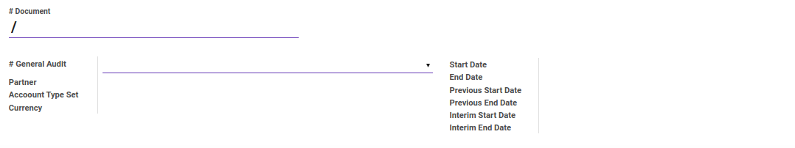
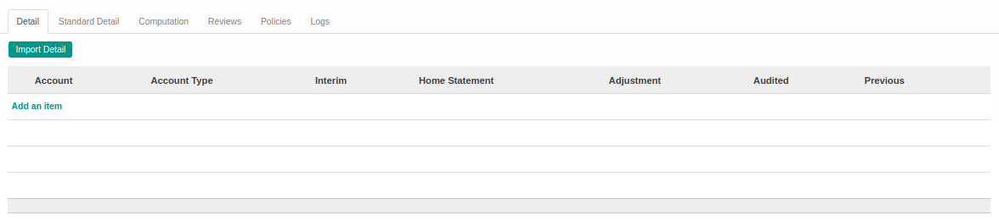
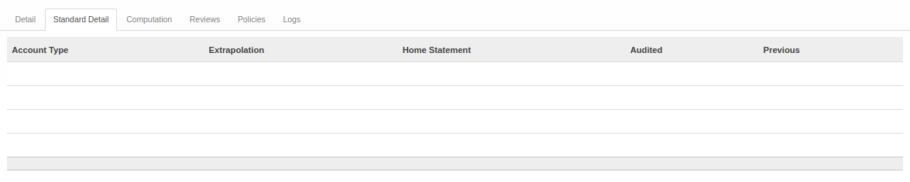
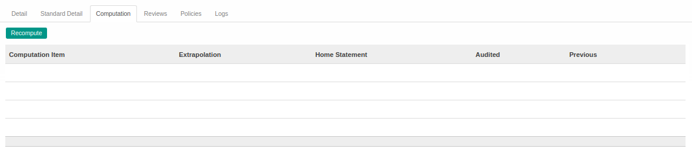
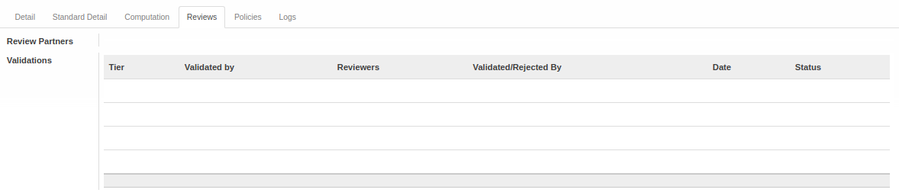
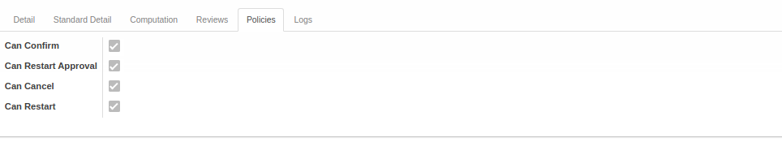
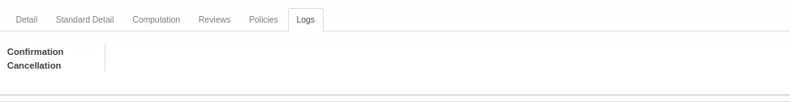

# Penjelasan Trial Balance

Informasi pada *Trial* dibagi menjadi beberapa bagian, yaitu:

* [Header](#bagian-header)
* [Tab Detail](#tab-detail)
* [Tab Standard Detail](#tab-standard-detail)
* [Tab Computation](#tab-computation)
* [Tab Reviews](#tab-reviews)
* [Tab Policies](#tab-policies)
* [Tab Logs](#tab-logs)

### <a name="bagian-header">HEADER</a>

#### <a name="field-no-document"># Document</a>

Nomor dokumen.

#### <a name="field-no-general-audit"># General Audit</a>

Nomor dokumen General Audit.

#### <a name="field-partner">Partner</a>

Nama partner.

#### <a name="field-account-type-set">Account Type Set</a>

Set tipe akun.

#### <a name="field-currency">Currency</a>

Mata uang.

#### <a name="field-start-date">Start Date</a>

Tanggal mulai audit.

#### <a name="field-end-date">End Date</a>

Tanggal akhir audit.

#### <a name="field-previous-start-date">Previous Start Date</a>

Tanggal mulai audit sebelumnya.

#### <a name="field-previous-end-date">Previous End Date</a>

Tanggal akhir audit sebelumnya.

#### <a name="field-interim-start-date">Interim Start Date</a>

Tanggal sementara mulai audit.

#### <a name="field-interim-end-date">Interim End Date</a>

Tanggal sementara akhir audit.

#### <a name="tab-detail">TAB DETAIL</a>

#### <a name="field-account">Account</a>

Nama Akun.

#### <a name="field-account-type">Account Type</a>

Tipe Akun.

#### <a name="field-interim">Interim</a>

to do.

#### <a name="field-home-statement">Home Statement</a>

to do.

#### <a name="field-home-adjustment">Adjustment</a>

to do.

#### <a name="field-audited">Audited</a>

to do.

#### <a name="field-previous">Previous</a>

to do.

#### <a name="tab-standard-detail">TAB STANDARD DETAIL</a>

#### <a name="field-standard-detail-account-type">Account Type</a>

Tipe Akun.

#### <a name="field-standard-detail-extrapolation">Extrapolation</a>

to do.

#### <a name="field-standard-detail-home-statement">Home Statement</a>

to do.

#### <a name="field-standard-detail-audited">Audited</a>

to do.

#### <a name="field-standard-detail-previous">Previous</a>

to do.

#### <a name="tab-computation">TAB COMPUTATION</a>

#### <a name="field-computation-item">Computation</a>

Item yang menjadi obyek perhitungan.

#### <a name="field-computation-extrapolation">Extrapolation</a>

to do.

#### <a name="field-computation-home-statement">Home Statement</a>

to do.

#### <a name="field-computation-audited">Audited</a>

to do.

#### <a name="field-computation-previous">Previous</a>

to do.

#### <a name="tab-reviews">TAB REVIEWS</a>

#### <a name="field-review-partners-validations">Review Partners Validations</a>

Nama-nama user yang dapat menyetujui/menolak *trial balance*

#### <a name="tabel-validations">TABEL Validations</a>

Tahapan-tahapan persetujuan *trial balance*

#### <a name="field-validations-tier">Tier</a>

Urutan persetujuan

#### <a name="field-validations-validated-by">Validated By</a>

Metode pemilihan user-user yang dapat menyetujui/menolak *trial balance*. Metode pemilihan terdiri dari 3 (tiga) yaitu:

1. *Specific user*. User-user yang dapat menyetujui/menolak *trial balance* ditentukan langsung.
2. *Any user in specific group*. User-user yang dapat menyetujui/menolak *trial balance* adalah user-user yang tergabung dalam kelompok-kelompok user yang ditentukan.
3. *Both specific user and group*. User-user yang dapat menyetujui/menolak *trial balance* ditentukan langsung ditambah dengan user-user yang tergabung dalam kelompok-kelompok user yang ditentukan.
4. *Python code*. User-user yang dapat menyetujui/menolak *trial balance* ditentukan oleh algoritma kode python tertentu

#### <a name="field-validations-reviewers">Reviewers</a>

Nama-nama user yang dapat menyetujui/menolak *trial balance* pada *tier* yang dimaksud.

#### <a name="field-validations-validated-rejected">Validated/Rejected By</a>

User yang menyetujui/menolak *trial balance*.

#### <a name="field-validations-date">Date</a>

Tanggal dan waktu **Validated/Rejected By** menyetujui/menolak *trial balance*

#### <a name="field-validations-date">Status</a>

Status persetujuan, terdiri dari 2 (dua) kemungkinan:

1. **Approved**. Tier disetujui.
2. **Rejected**. Tier ditolak.

#### <a name="tab-policies">TAB POLICIES</a>

#### <a name="field-confirm">Can Confirm</a>

Berhak/tidaknya user aktif untuk dapat mengkonfirmasi trial balance.

#### <a name="field-restart-approval">Can Restart Approval</a>

Berhak/tidaknya user aktif untuk dapat merestart persetujuan trial balance.

#### <a name="field-cancel">Can Cancel</a>

Berhak/tidaknya user aktif untuk dapat membatalkan trial balance.

#### <a name="field-restart">Can Restart</a>

Berhak/tidaknya user aktif untuk dapat merestart trial balance.

#### <a name="tab-logs">TAB LOGS</a>

#### <a name="field-confirmation">Confirmation</a>

Waktu konfirmasi dan user yang mengkonfirmasi trial balance.

#### <a name="field-cancellation">Cancellation</a>

Waktu batal dan user yang membatalkan trial balance.
